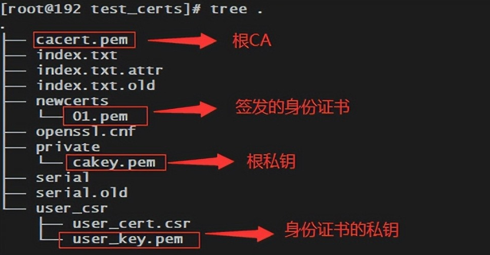
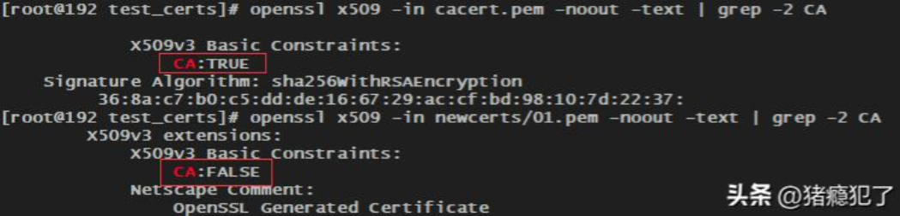

# 常用查询命令

**1、查看私钥信息**

```bash
openssl rsa -in xxx.key -noout -text
```

**2、查看公钥信息**

```bash
openssl rsa -pubin -in xxx.key -noout -text
```

**3、查看证书请求**

```bash
openssl req -in xxx.csr -noout -text
```

**4、查看证书信息**

```bash
openssl x509 -in xxx.crt -noout -text
```

# 自签名CA证书及颁发身份证书

**1、生成CA的私钥**

```bash
openssl genrsa -out cakey.pem 2048
```

**2、根据私钥生成自签名CA证书**

先使用自己的私钥生成包含自己公钥的csr请求，再使用自己的私钥签名自己的公钥，以下命令将这两步合并成一步执行：

```bash
openssl req -new -x509 -key cakey.pem -out cacert.pem -days 365 \
	-subj "/C=CN/ST=JS/L=NJ/O=NT/OU=NT/CN=nothing/emailAddress=nothing@nn.com"
```

**3、生成身份证书的私钥**

```bash
mkdir -p user_csr

openssl genrsa -out user_csr/user_key.pem 2048
```

**4、根据私钥生成身份证书的csr请求**

```bash
openssl req -new -key user_csr/user_key.pem -out user_csr/user_cert.csr \
	-subj "/C=CN/ST=JS/L=NJ/O=NT/OU=NT/CN=host1"
```

**5、根据csr请求生成身份证书**

```bash
mkdir -p private

mv cakey.pem private/cakey.pem

mkdir -p newcerts

touch index.txt

echo 01 > serial

cp /etc/pki/tls/openssl.cnf ./openssl.cnf

vim openssl.cnf # 修改文件中的dir的取值为$HOME

openssl ca -in user_csr/user_cert.csr -config openssl.cnf
```

最终的目录结构如下，其中01.pem为根CA签发的身份证书：



# CA证书与身份证书的区别

* CA证书可以验签身份证书，身份证书无法验签CA证书
* 证书中x509扩展字段的Basic Constraints，CA证书为TRUE，身份证书为FALSE


