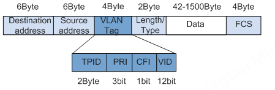
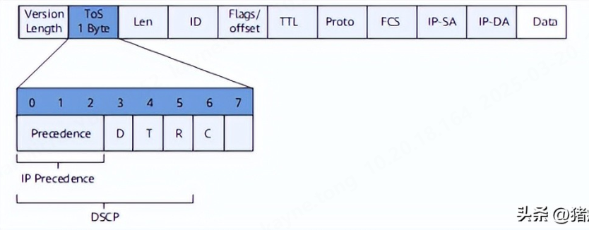
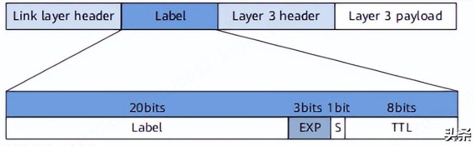

CoS（Class of Serivce）服务等级，通过将数据包进行分类来实现差异化服务。CoS主要工作在数据链路层（交换机），通过标记数据包来区分高、低优先级的流量，确保高优先级的数据包能够优先通过网络。CoS主要的实现方式有以下三种：

# 802.1p

802.1p是一种常见的CoS实现方法，与802.1q（VLAN）共同运作。利用VLAN标签中的PCP（Priority Code Point，3bit）字段来标记和区分优先级。802.1p提供了8个优先级级别（0~7），每个级别代表不同的服务优先级。例如，7通常用于网络控制数据，5和6用于视频和语音数据，而较低的优先级用于普通数据传输。

# IP DSCP

DSCP（Differentiated Services Code Point）差分服务代码点，它存在于IP头部的ToS标识中，占用ToS的高6bit，通过编码值来区分优先级，提供了64个优先级级别（0~63）。

# MPLS EXP

MPLS（Multiprotocol Label Switching）是一种基于标签的交换技术，它可以根据预定义的服务类对数据流进行分类和处理。MPLS标签头中的EXP（Expedited Forwarding）字段用于标记数据流的优先级和服务类别，该字段共3bit，提供了8个优先级级别（0~7）。MPLS网络设备可以根据这些标签快速转发数据包，并为不同服务类别的数据流提供不同的服务质量。
