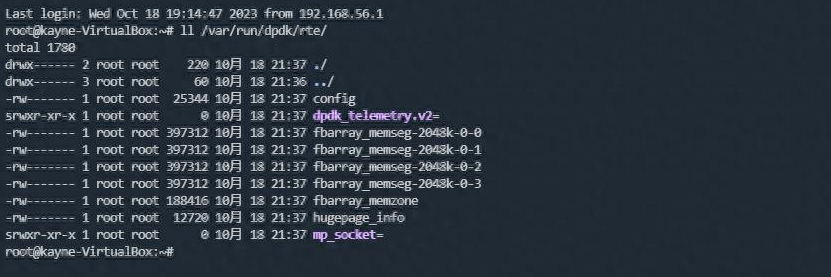

testpmd常用的多进程参数有两个：`--proc-type`和`--file-prefix`，这两个参数都和进程间的共享配置有关。



**--proc-type** 指定共享配置（hugepage、telemetry、mp_socket）的两个进程的类型，一个是primary（主进程）， 一个是secondary（从进程），primary可以创建共享配置，secondary只能attach共享配置。比如：

```bash
--proc-type=primary   # 启动的dpdk进程为主进程
--proc-type=secondary # 启动的dpdk进程为从进程
```

**--file-prefix** 指定共享配置（hugepage、telemetry、mp_socket）的路径前缀，如果不指定该参数，默认为/var/run/dpdk/rte，该参数通常用于两个独立的primary进程。比如：

```bash
--file-prefix=vhost   # 配置文件位于/var/run/dpdk/vhost目录下
--file-prefix=virtio  # 配置文件位于/var/run/dpdk/virtio目录下
```
