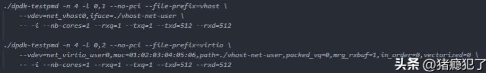
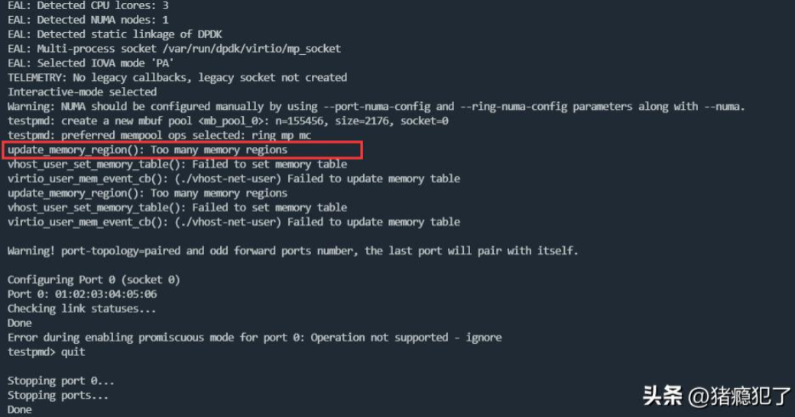
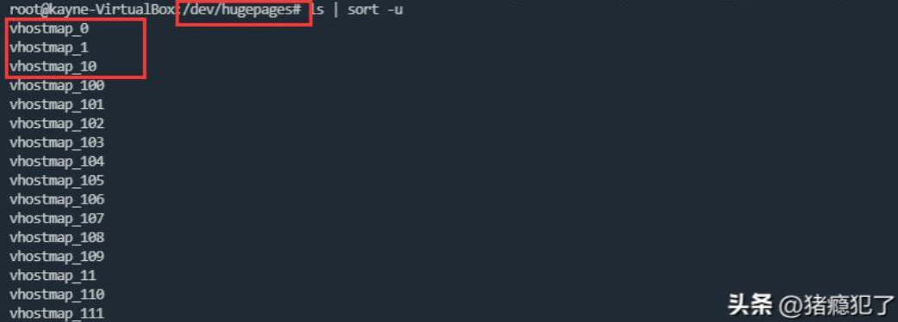
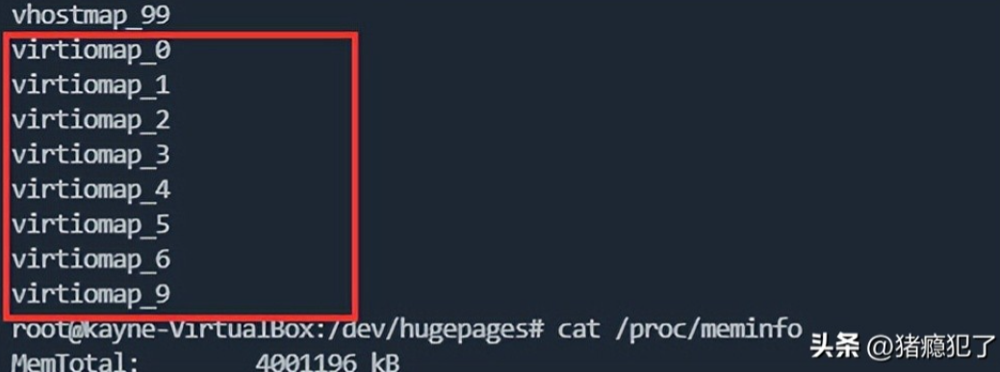
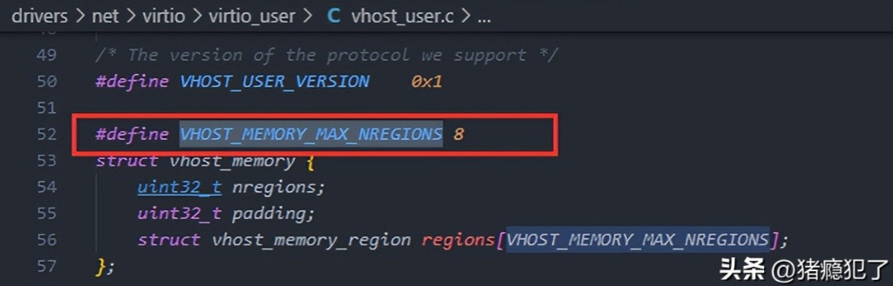
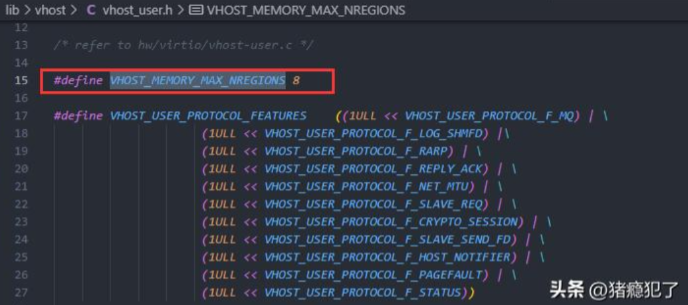
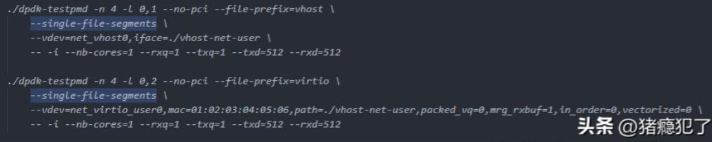
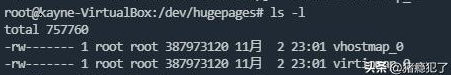

# 遇到的问题

在使用以下命令拉起vhost-user device和virtio-user driver时，遇到了"Too many memory regions"问题：

遇到的问题现象如下：

# 产生的原因

原因是我使用的是2M的大页内存，memory_regions比较多，vhost侧产生的region有100多个，而virtio侧协商时最多支持VHOST_MEMORY_MAX_NREGIONS（8）个region，超过8个会报错。

# 解决的方法

- 一种解决方法是修改源码，将VHOST_MEMORY_MAX_NREGIONS修改为1000，亲测有效，需要注意的是要修改两个地方，一个lib/vhost下的，一个drivers/net/virtio下的，然后再编译运行即可。

- 另外一种解决方法是启动时加上--single-file-segments选项，可以将memory文件变为一个：

此时再查看/dev/hugepages目录，会发现vhost侧和virtio侧的memory map文件都只变成了一个：

