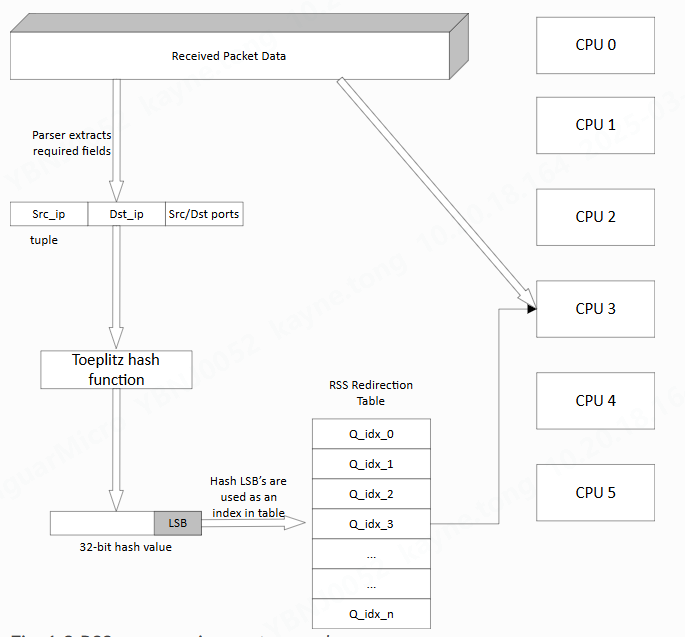

# 什么是rss?

Receive Side Scaling（RSS）指具有RSS能力的网卡硬件通过计算网络数据报文中的网络层&传输层二/三/四元组HASH值，然后根据HASH值把不同的报分发到不同CPU core上做接收处理，从而降低某一个CPU的利用率。



常用的Hash算法有：

* Microsoft Toeplitz Hash，在计算过程中使用到一个320位（40字节）的Random Secret Key作为加密密钥。
* Symmetric Toeplitz Hash，在Microsoft Toeplitz Hash的基础上，将src，dst替换为xor(src, dst)。
* Simple XOR，只作简单的xor运算。

LSB（Least Significant Bit）为Hash的最低有效位，为了方便快速计算，只取32位的最低几位。也正是由于它只考虑了最低几位，哈希冲突的可能性也随之增大。

# DPDK对rss的支持

参见lib/ethdev/rte_flow.h：

```c
/**
 * Hash function types.
 */
enum rte_eth_hash_function {
	/** DEFAULT means driver decides which hash algorithm to pick. */
	RTE_ETH_HASH_FUNCTION_DEFAULT = 0,
	RTE_ETH_HASH_FUNCTION_TOEPLITZ, /**< Toeplitz */
	RTE_ETH_HASH_FUNCTION_SIMPLE_XOR, /**< Simple XOR */
	/**
	 * Symmetric Toeplitz: src, dst will be replaced by
	 * xor(src, dst). For the case with src/dst only,
	 * src or dst address will xor with zero pair.
	 */
	RTE_ETH_HASH_FUNCTION_SYMMETRIC_TOEPLITZ,
	/**
	 * Symmetric Toeplitz: L3 and L4 fields are sorted prior to
	 * the hash function.
	 *  If src_ip > dst_ip, swap src_ip and dst_ip.
	 *  If src_port > dst_port, swap src_port and dst_port.
	 */
	RTE_ETH_HASH_FUNCTION_SYMMETRIC_TOEPLITZ_SORT,
	RTE_ETH_HASH_FUNCTION_MAX,
};
```

也可参考dpdk官网给出的解释：
https://doc.dpdk.org/guides/prog_guide/toeplitz_hash_lib.html
