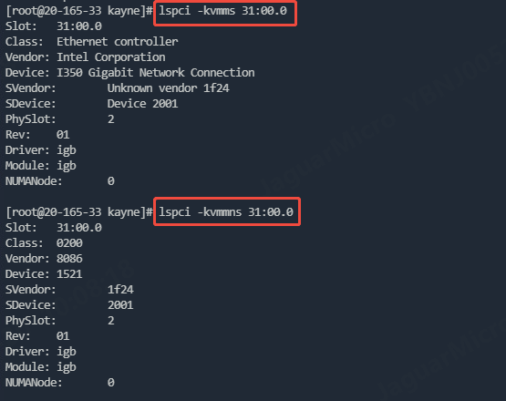

# 手动绑定与解绑dpdk驱动

dpdk驱动可以通过`dpdk-devbind.py`脚本来绑定和解绑，该脚本的具体操作如下：

以`slot = 0000:3b:00.0, dpdk_driver = vfio-pci, vendor = 0x8086, device = 0x100e`为例，其中

- `slot` 为设备的PCI插槽号，即设备的PCI号
- `dpdk_driver` 驱动选用vcfio-pci（也可以使用igb_uio）
- `vendor` 为厂商号，0x8086为Intel厂商，可以通过/sys/bus/pci/devices/0000:3b.00.0/vendor查到
- `device` 为设备号，0x100e为82540EM网卡，可以通过/sys/bus/pci/devices/0000:3b.00.0/device查到

设备信息也可以通过`lspci -kvmms`和`lspci -kvmmns`查看（后者多个n表示以数字形式查看）。



# 对于linux-3.15及以上的版本

绑定

```bash
echo "vfio-pci" > /sys/bus/pci/devices/0000:3b.00.0/driver_override
echo "0000:3b.00.0" > /sys/bus/pci/drivers/vfio-pci/bind
```

解绑

```bash
echo "0000:3b.00.0" > /sys/bus/pci/drivers/vfio-pci/unbind
```

# 对于linux-3.15以下的版本

绑定

```bash
echo "8086 100e" > /sys/bus/pci/drivers/vfio-pci/new_id
echo "0000:3b.00.0" > /sys/bus/pci/drivers/vfio-pci/bind
```

解绑

```bash
echo "0000:3b.00.0" > /sys/bus/pci/drivers/vfio-pci/unbind
```

# 绑定方式对比

可以发现: 解绑驱动的方式是没有发生变化，只有绑定驱动的方式有区别，3.15以上使用的是driver_override字段，而3.15以下使用的是new_id字段。
