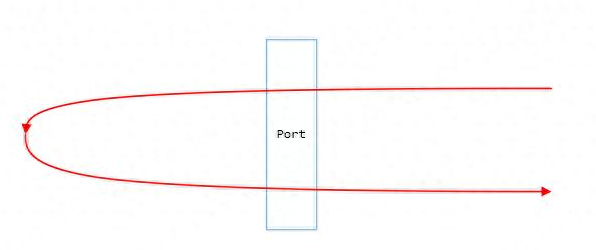

# 为什么叫Hairpin

Hairpin中文翻译为发卡，网络中因其流量的走向似一个发卡，故称该流量为发卡流量。其实可以简单的理解为单端口的流量环回：即报文从当前端口的RX队列进来后，再从当前端口的TX队列发出。

# 什么是Hairpin

交换机一般不允许一个报文从收到该报文的端口发出，比如交换机在某个端口收到一个广播报文后，会将其广播到所有其他的端口，而不会广播到当前接收的端口。交换机的某个端口打开Hairpin模式后，允许从这个端口将收到的包仍然从该端口发出。

这个特性常用于NAT场景：比如docker的NAT网络，一个容器访问其自身映射到主机的端口时，报文到达网桥设备后走到IP协议栈，经过iptables规则的DNAT转换后，发现又需要从网桥的接收端口发出，此时需要开启端口的Hairpin模式。
