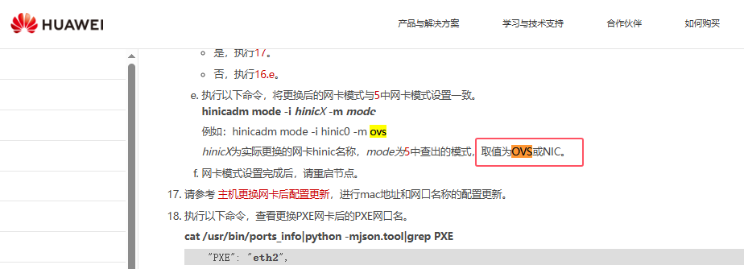
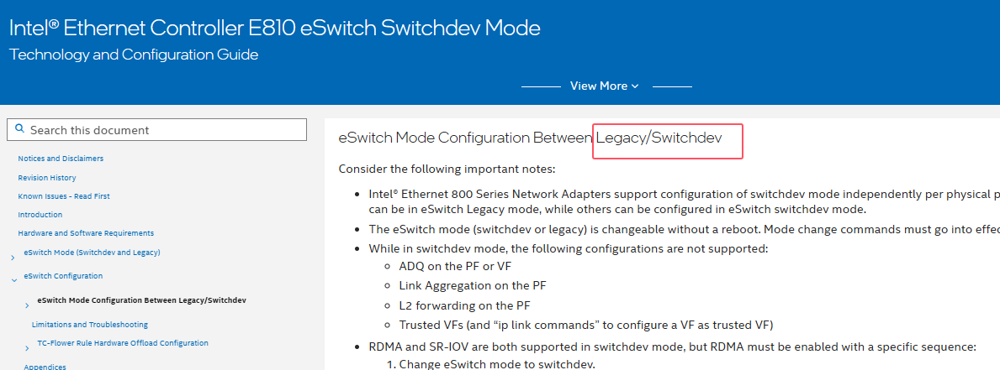

**legacy模式** ，就是大家平时所说的标卡模式，即将网卡当作一块普通的网卡来使用。legcay模式大家都比较熟悉，那么问题来了，什么是switchdev？为什么需要switchdev？

**switchdev是switch device的缩写** ，简单地讲，就是将网卡当作交换机来使用（前提是该网卡具备交换能力）。通常情况下，设备厂商用交换芯片设计生产一个交换机或路由器产品时，需要配套开发一个网络操作系统（NOS），或者配套移植一个类似于SONIC的开源产品，并向用户提供相关的软件开发工具包（SDK）来实现软硬件的交互。switchdev的出现摆脱了这些繁杂的SDK和NOS，因为它利用大家熟知的linux开源框架，使用linux环境和工具就可以将网卡配置成一个交换设备，从而消除了对厂商特定API的依赖。

需要注意的是，switchdev位于linux的内核层，它可以将内核的数据转发平面卸载到交换机的ASIC芯片上。内核的设备驱动模型如下（switchdev）：

```bash
			     User-space tools

       user space                   |
      +-------------------------------------------------------------------+
       kernel                       | Netlink
				    |
		     +--------------+-------------------------------+
		     |         Network stack                        |
		     |           (Linux)                            |
		     |                                              |
		     +----------------------------------------------+

			   sw1p2     sw1p4     sw1p6
		      sw1p1  +  sw1p3  +  sw1p5  +          eth1
			+    |    +    |    +    |            +
			|    |    |    |    |    |            |
		     +--+----+----+----+----+----+---+  +-----+-----+
		     |         Switch driver         |  |    mgmt   |
		     |        (this document)        |  |   driver  |
		     |                               |  |           |
		     +--------------+----------------+  +-----------+
				    |
       kernel                       | HW bus (eg PCI)
      +-------------------------------------------------------------------+
       hardware                     |
		     +--------------+----------------+
		     |         Switch device (sw1)   |
		     |  +----+                       +--------+
		     |  |    v offloaded data path   | mgmt port
		     |  |    |                       |
		     +--|----|----+----+----+----+---+
			|    |    |    |    |    |
			+    +    +    +    +    +
		       p1   p2   p3   p4   p5   p6
```

**目前很多厂商的网卡都同时具备legcay和switchdev能力** ：

* 比如华为的Hi1822网卡同时支持legacy和switchdev模式，只不过叫法不同，legacy模式叫NIC，switchdev模式叫OVS，详细参见：https://support.huawei.com/enterprise/zh/doc/EDOC1100327176/d267fce9



* 再比如英特尔的E810网卡同时支持legacy和switchdev模式，详细参见：https://edc.intel.com/content/www/tw/zh/design/products/ethernet/appnote-e810-eswitch-switchdev-mode-config-guide/eswitch-mode-configuration-between-legacy-switchdev/?language=zh-tw


