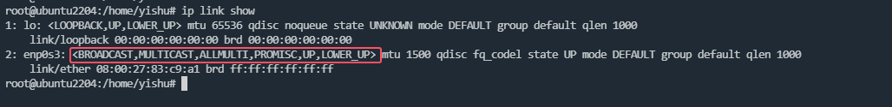

# 单播地址/组播地址/广播地址

这里说的地址，都是针对MAC地址（目的MAC地址），非IP地址（IP地址也有组播和广播）。MAC地址一共6字节（48bit），最高字节的最低bit位是组播地址标识位。按照该标识位是否为1，可将MAC地址划分为单播地址/组播地址/广播地址：

```bash
单播：xxxxxxx0-xxxxxxxx-xxxxxxxx-xxxxxxxx-xxxxxxxx-xxxxxxxx（地址由高到低）
组播：xxxxxxx1-xxxxxxxx-xxxxxxxx-xxxxxxxx-xxxxxxxx-xxxxxxxx（地址由高到低）
广播：11111111-11111111-11111111-11111111-11111111-11111111（地址由高到低）
```

需要注意的是，广播是一种特殊的组播。

# 单播模式

这是网卡最常用的一种模式，只接收目的MAC为当前网卡MAC的报文，其它报文一律丢弃。该模式为默认选项，无须配置。

# 组播模式

网卡只接收指定MAC的组播报文，这些组播MAC需要提前配置好，又叫组播白名单，内核中通过mc_list实现。

在linux上可以通过ip link set eth0 multicast on/off来配置，配置成功后，ip link show eth0能够看到MULTICAST字样。

# 组播混杂

组播混杂又叫全组播，在该模式下，流经网卡的所有组播报文都允许被接收。

在linux上可以通过ip link set eth0 allmulticast on/off来配置，配置成功后ip link show eth0能够看到ALLMULTI字样。

# 广播模式

这也是网卡常用的一种模式，网卡允许接收MAC地址全F的报文，常见的有ARP广播报文。

在linux上可以通过ip link set eth0 broadcast on/off来配置，配置成功后ip link show eth0能够看到BROADCAST字样。

# 混杂模式

网卡会接收所有报文。

在linux上可以通过ip link set eth0 promisc on/off来配置，配置成功后ip link show eth0能够看到PROMISC字样。

# 配置示例


