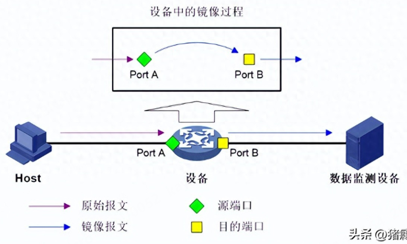
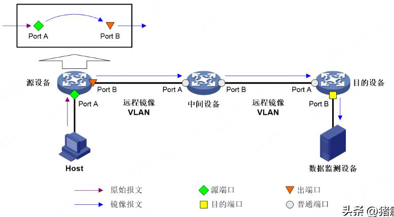
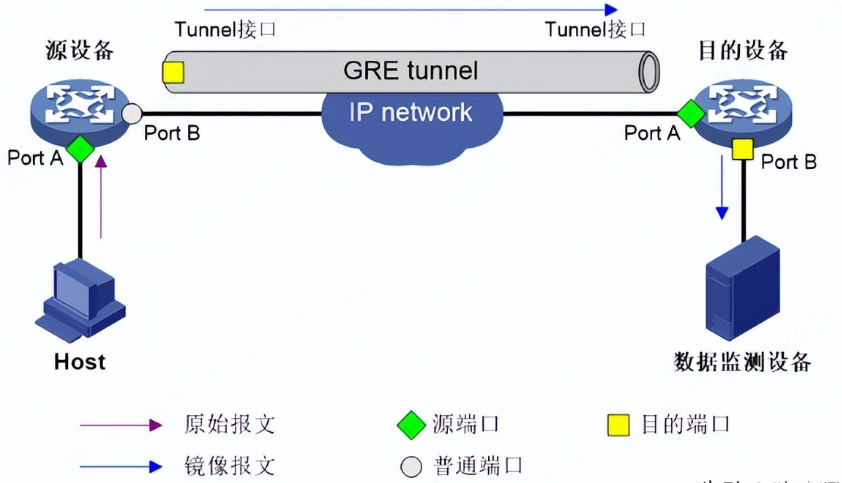

# 什么是镜像

镜像是指将指定端口的流量复制一份，再发往另一个端口进行观测和分析，这个被复制流量的端口叫作**源端口** ，复制完发往的端口叫作**目的端口** 。被复制的报文叫作**原始报文** ，复制后生成的报文叫作**镜像报文** 。

# SPAN本地镜像

源端口和目的端口位于同一台交换设备上，这个镜像的过程称为本地镜像（SPAN，Switched Port Analyzer）。

# RSPAN二层远程镜像

源端口和目的端口位于不同的交换设备上，并且通过二层转发送往目的地，这个过程称为二层远程镜像（RSPAN，Remote Switched Port Analyzer）。

# ERSPAN三层远程镜像

源端口和目的端口位于不同的交换设备上，并且通过三层转发（封装GRE头）送往目的地（封装GRE头），这个过程称为三层远程镜像（ERSPAN，Encapsulated Remote Switched Port Analyzer）。

