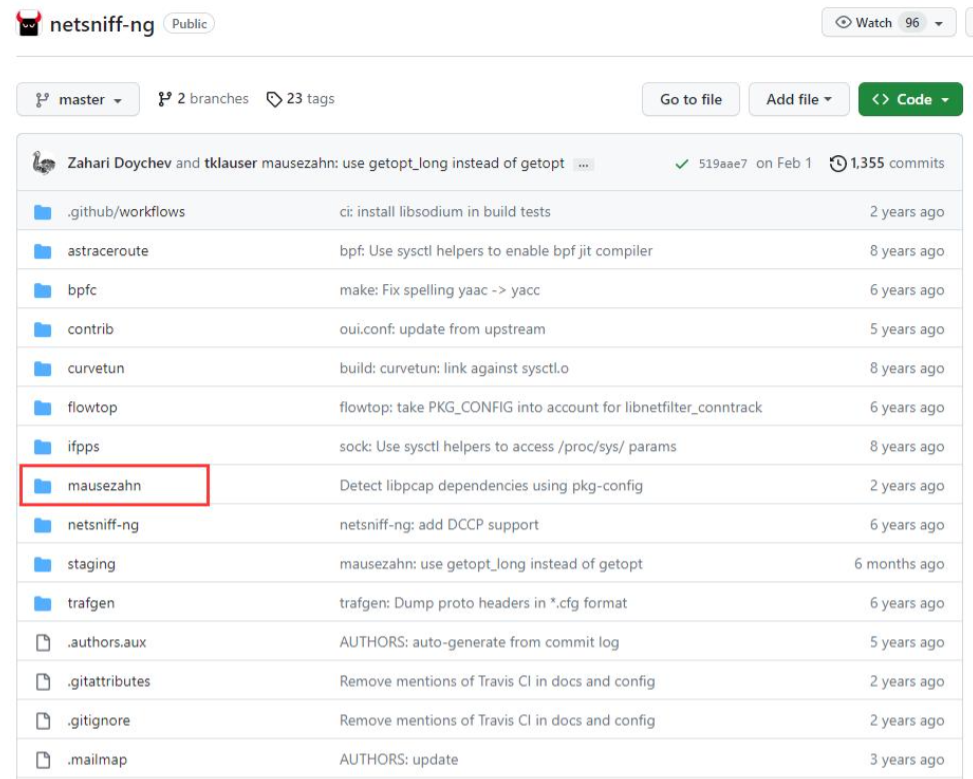

mausezahn是一个非常好用的发包工具，几乎可以发任何包。mausezahn当前是netsniff-ng的一个子模块：
https://github.com/netsniff-ng/netsniff-ng



# mausezahn构建

```bash
git clone https://github.com/netsniff-ng/netsniff-ng

cd netsniff-ng

./configure –prefix=`pwd`/install

make && make install
```

以上命令会在当前目录下生成`install/sbin/mausezahn`，如果依赖不满足，则不会编译生成该二进制文件，需要自己先安装好相关依赖包。

# mauseazhn选项

-x CLI命令行交互模式，默认端口25542

-l 使用交互械时监听的IP地址，默认为0.0.0.0

-4 IPV4，默认选项

-6 IPv6

-R 设置socket的优先级

-c 发送的包的个数, 默认为1，0表示一直发

-d 发包间隔，默认单位为us，也可以指定单位，如100ms，100s

-r 将-d指定的发包间隔乘以为一个随机值

-p 指定帧的长度，使用随机数填充

-a 指定源MAC地址或一个关键字，默认为发包端口的MAC地址

-b 指定目的MAC地址，和源MAC类似，关键字如下：

rand 使用一个随机的MAC地址

bc 使用广播的MAC地址

own 使用网卡的MAC地址，默认选项

stp 使用IEEE 802.1d STP广播地址

cisco 使用cisco的广播地址（CDP, VTP, or PVST+）

-A 指定源IP，默认为网卡的IP

-B 指定目的IP

-P 使用指定的ASCII码字符作为payload

-f 从指定文件读取ASCII码字符作为payload

-F 从指定文件读取十六进制数作为payload

-Q `[CoS:]vlan` 指定802.1Q VLAN和CoS，多个VLAN用逗号分开，如 '5:10,20,2:30'

-t 指定包的类型，如arp, bpdu, cdp, ip, icmp, udp, tcp, dns, rtp, syslog, lldp等

-V|VV|... 打印mausezahn发包的详细过程

-q 静默模式，不打印任何信息

-S 仿真模式，不向物理链路上发包，通常与-V一起用

-v 显示mausezahn版本

-h 打印帮助信息

# mausezahn使用举例

```bash
mausezahn -x 99

mausezahn -c 0 -d 2s -t bpdu conf

mausezahn -t cdp change -c 0

mausezahn -t syslog sev=3 -P "You have been mausezahned." -A 10.1.1.109 -B 192.168.7.7

mausezahn eth0 -A rand -B 1.1.1.1 -c 0 -t tcp "dp=1-1023, flags=syn"
```
