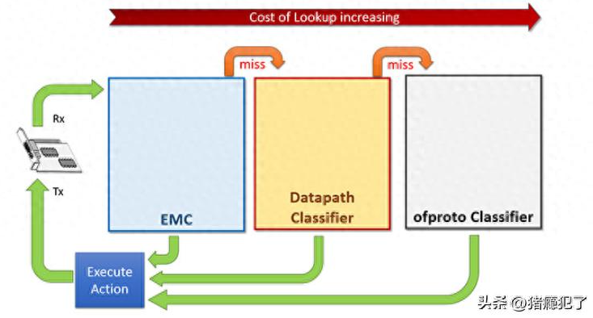
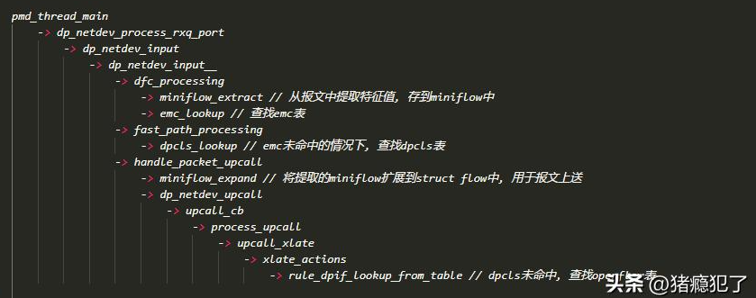
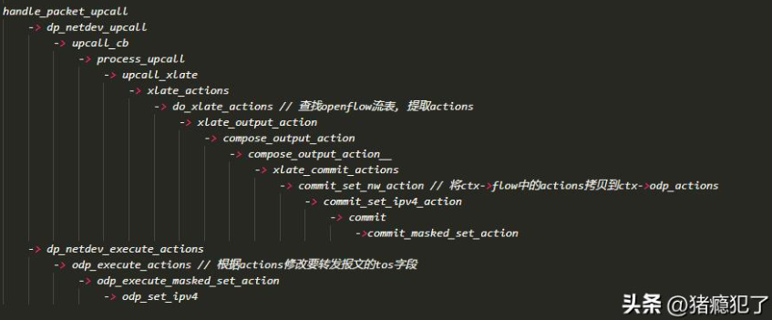
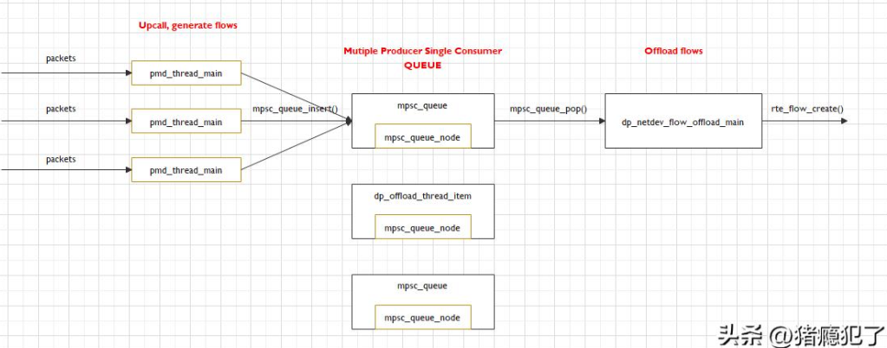
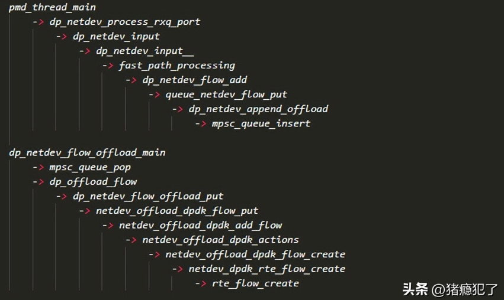

# ovs编译

```bash
git clone https://gitee.com/mirrors/ovs.git
cd ovs
git checkout v2.17.7
./boot.sh
./configure
make -j
make install
```

ovs默认安装在/usr/local/，/var/，/etc/目录下，./configure时可通过`--prefix`，`--localstatedir`，`--sysconfdir`指定安装和运行目录

# ovs运行

**启动ovsdb-server**

```bash
ovsdb-server \
	--remote=punix:/var/run/openvswitch/db.sock \
	--remote=db:Open_vSwitch,Open_vSwitch,manager_options \
	--private-key=db:Open_vSwitch,SSL,private_key \
	--certificate=db:Open_vSwitch,SSL,certificate \
	--bootstrap-ca-cert=db:Open_vSwitch,SSL,ca_cert \
	--pidfile \
	--detach \
	--log-file
```

**启动ovs-vswitchd**

```bash
ovs-vswitchd --pidfile --detach --log-file
```

# ovs port类型

原生ovs的port有四种类型：normal、internal、patch、tunnel（不包括dpdk类型端口，dpdk端口类型由dpdk实现）。


| **类型** | **功能**                                                                                                                         |
| ---------- | ---------------------------------------------------------------------------------------------------------------------------------- |
| normal   | 用户可以把操作系统上的网卡绑定到ovs上，ovs会生成一个普通的端口处理这块网卡进出的数据包。                                         |
| internal | ovs会创建一块虚拟网卡，虚拟网卡会自动与Port绑定。当ovs创建一个新网桥时，默认会创建一个与网桥同名的port。                         |
| patch    | 当ovs中有多个网桥时，可以使用patch port将两个网桥连接起来，patch port总是成对出现，分别连接在两个网桥上，相当于内核的veth pair。 |
| tunnel   | 隧道端口是一种虚拟端口，支持使用gre或vxlan等隧道技术与位于网络上其它位置的远程端口通讯。                                         |

# ovs datapath类型

ovs的转发平面称为datapath，目前有三种实现方式：

1、内核层实现（dpif-netlink），也是默认的实现方式（openvswitch.ko）

2、用户层实现（dpif-netdev），实现方式一般为ovs+dpdk

3、硬件层实现，当前比较流行的dpu，将流表卸载到硬件网卡

# ovs报文转发流程

该部分内容更加详细的参见：
https://www.intel.cn/content/www/cn/zh/developer/articles/technical/ovs-dpdk-datapath-classifier.html

ovs的报文转发流程如下，共涉及三种类型的流表：



1、Ofproto Classifier（openflow），又称慢速路径，本质上是openflow流表在ovs中的存在形式，由Controller控制器通过openflow协议下发，或由ovs-ofctl命令手动下发。每个网桥都有自己的openflow流表，相关数据结构有`struct classifier`（openflow流表，位于`struct oftable`结构体中，包含若干个子表），`struct cls_subtable`（openflow子表，相同掩码的表项放在同一个子表里面），`struct rule`（openflow表项）

2、Datapath Classifier（dpcls），又称快速路径，datapath的一种缓存技术，每个（入）端口都有自己的dpcls表，相关的数据结构有`struct dpcls`（dpcls表，包含若干个子表），struct dpcls_subtable（dpcls子表，相同掩码的表项放在同一个子表中），`struct dpcls_rule`（dpcls表项）

3、Exact Match Cache（emc），精确匹配表，datapath的更加快速的一种缓存技术，每个pmd线程都有自己的emc表，相关的数据结构有`struct emc_cache`（emc表），`struct emc_entry`（emc表项）

需要注意的是：`struct miniflow`用于从报文中提取特征值，比如IP、MAC等，struct flow由miniflow扩展而来（包含报文的特征值），用于匹配openflow的`struct rule`，openflow的表项存放在`struct rule`中，不存放在`struct flow`中！！！

查表流程：



# ovs action翻译与执行流程

一条openflow流表下发到ovs后，会存放在`struct rule`结构中，报文上送时，会翻译`struct rule`中的actions，并将action应用于报文。流程如下（以mod_nw_tos为例）：



# ovs 流表卸载流程

pmd_thread_main为dpdk的pmd线程，dp_netdev_flow_offload_main为ovs的流表卸载线程。二者为多对一的关系，通过mpsc（mutilple producer single consumer）队列联系在一起。



调用流程如下：



# ovs-appctl常用命令

```bash
# 列出ovs-appctl支持的所有命令，可以通过grep过滤
ovs-appctl list-commands

# 列出所有支持记录日志的模块和它们当前的日志等级（日志方式：console/syslog/file，日志级别：off/emer/err/warn/info/dbg）
ovs-appctl vlog/list 

# 设置所有模块的日志级别为info
ovs-appctl vlog/set info

# 设置vswitchd模块的file日志的日志级别为warn
ovs-appctl vlog/set vswitchd:file:warn

# 默认情况下，ovs-vswitchd限制了日志的速率，该命令可以解除限制
ovs-appctl vlog/disable-rate-limit

# 限制日志的记录速率
ovs-appctl vlog/enable-rate-limit

# 设置arp缓存
ovs-appctl tnl/arp/set

# 查看arp缓存
ovs-appctl tnl/arp/show

# 清除arp缓存
ovs-appctl tnl/arp/flush
```

# ovs-ofctl常用命令

```bash
# 查询ovs的版本以及ovs支持的openflow的版本，"OpenFlow versions 0x1:0x6"表示支持OpenFlow1.1~OpenFlow1.6的版本
ovs-ofctl --version

# 查询br-ext网桥的流表相关信息
ovs-ofctl show br-ext

# 在br-ext网桥上添加流表，从dpdk0进入的源IP为1.1.1.1/24的包，从dpdk1口出去
ovs-ofctl add-flow br-ext nw_src=1.1.1.1/24,dl_type=0x0800,in_port=dpdk0,action=output:dpdk1

# 查询br-ext网桥上的流表，--name使用端口名显示，--no-names使用端口号显示
ovs-ofctl dump-flows br-ext --names

# 删除br-ext网桥上的所有流表
ovs-ofctl del-flows br-ext

# 查询br-ext网桥上的ofproto端口，--name使用端口名显示，--no-name使用端口号显示
ovs-ofctl dump-ports br-ext --names
```

# ovs-vsctl常用命令

```bash
# 查询ovs的拓扑信息
ovs-vsctl show

# 添加一个网桥，datapath类型为netdev，fail-mode故障模式为secure
ovs-vsctl add-br br-ext -- set bridge br-ext datapath_type=netdev -- set bridge fail-mode=secure

# 设置br-int网桥的故障模式为secure
ovs-vsctl set-fail-mode br-int secure

# 获取br-int网桥的故障模式
ovs-vsctl get-fail-mode br-int

# 删除br-ext网桥
ovs-vsctl del-br br-ext

# 在br-ext网桥上添加一个dpdk0端口，options为dpdk端口的配置参数
ovs-vsctl add-port br-ext dpdk0 -- set interface dpdk0 type=dpdk options:dpdk-devargs=net_virtio_user0,mac=11:22:33:44:55:66,path=/tmp/vhost0,queue=1

# 删除dpdk0端口
ovs-vsctl del-port dpdk0
```

注意：ovs在连接不上控制器时会进入故障模式（fail_mode），fail_mode有两种状态：standlone，secure。如果配置了standlone模式，一旦无法连接控制器，ovs将清除控制器下发的流表，自己接管转发，此时ovs作为一个标准的MAC学习的二层交换机。如果配置了secure模式，一旦无法连接控制器，ovs将按照原来的流表继续转发。
