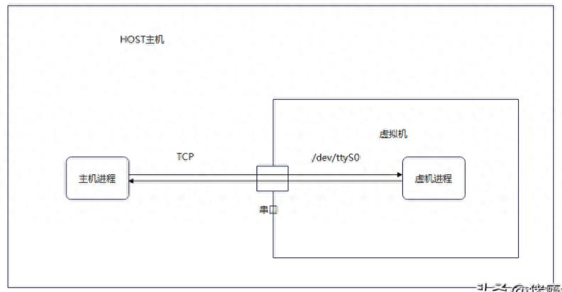
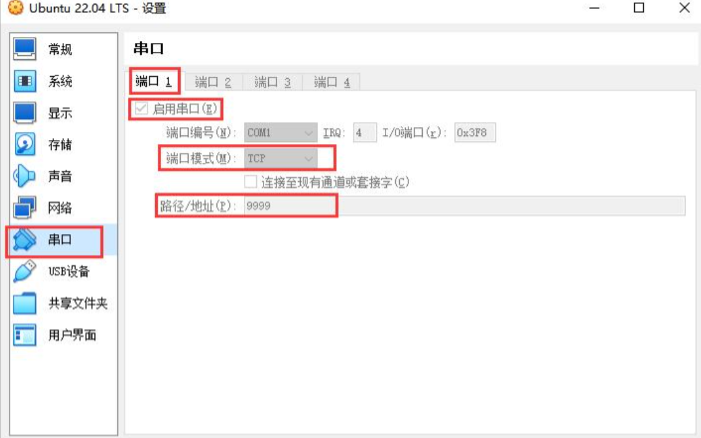

# 实验组网

组网图如下，在HOST主机上通过TCP连接串口。这里有一个疑问：串口为什么可以通过TCP连接？因为VirtualBox帮我们做了串口设备输入输出的重定向，将对串口的读写重定向到了TCP连接。而虚机内则是正常的串口读写，使用PySerial库。



# VBox串口配置



VirtualBox创建串口的模式一共有4种（上图中的端口模式，这里我选择的TCP）：

1、主机管道：使用HOST主机管道的路径通信，例如：Windows下的\.\pipe\mypipe，Linux下的/tmp/mypipe

2、主机设备：使用HOST主机的串口设备通信，例如：Windows下的COM1，Linux下的/dev/ttyS0

3、裸文件：使用HOST主机的存储文件通信

4、TCP：使用HOST的TCP连接通信，如果只指定"端口号"则为Server，如果指定"主机名：端口号"则为Client

# HOST发送VM接收

在HOST主机上使用socket发送消息：

```python
Python 3.9.10 (tags/v3.9.10:f2f3f53, Jan 17 2022, 15:14:21) [MSC v.1929 64 bit (AMD64)] on win32
Type "help", "copyright", "credits" or "license" for more information.
>>> import socket
>>> sock = socket.socket(socket.AF_INET, socket.SOCK_STREAM)
>>> sock.connect(('127.0.0.1',9999))
>>> sock.send('hahaha'.encode())
6
>>>
```

在虚机中使用PySerial接收消息：

```python
Python 3.10.12 (main, Nov 20 2023, 15:14:05) [GCC 11.4.0] on linux
Type "help", "copyright", "credits" or "license" for more information.
>>> import serial
>>> ser = serial.Serial('/dev/ttyS0', 9600)
>>> ser.read(6)
b'hahaha'
>>>
```

# VM发送HOST接收

在虚机中使用PySerial发送消息：

```python
>>> ser.write('hahaha'.encode())
6
>>>
```

在HOST主机上使用socket接收消息：

```python
>>> sock.recv(6)
b'hahaha'
>>>
```
