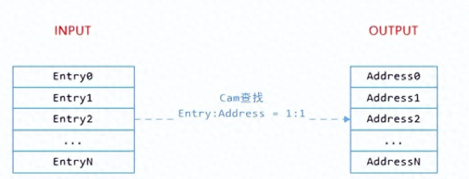
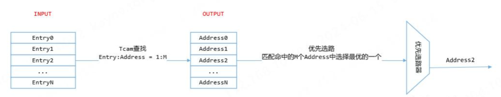
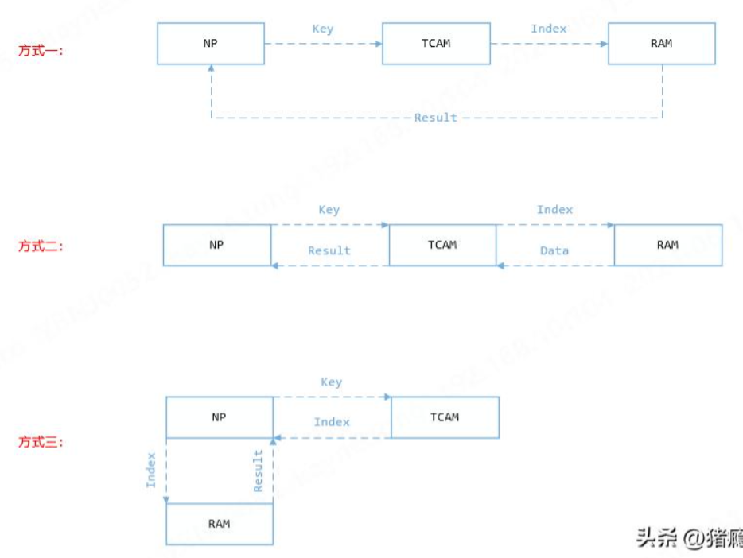

RAM（Random Access Memory），随机存取存储器。所谓"随机存取"，是指它允许以任意顺序（随机）访问任何存储单元，且每个单元的访问时间是恒定的，不依赖于其所处位置。简单的讲，就是我们平时所说的"主存"。支持以下两种操作：

* 写，输入地址和数据，将数据写到指定的地址
* 读，输入地址，返回该地址存放的数据

CAM（Content Addressable Memory），内容寻址存储器。所谓"内容寻址"，就是根据"内容"找到"该内容存放的地址"。支持以下三种操作：

* 写，输入地址和数据，将数据写到指定的地址
* 读，输入地址，返回该地址存放的数据
* 查，输入数据，返回该数据所在的地址

TCAM（Ternary Content Addressable Memory），三态内容寻址存储器。在CAM的基础上多了个三态，CAM的每个bit只支持"0"和"1"两种状态，而TCAM的每个bit支持"0"、"1"、"X"三种状态，其中"X"表示"Don't care"，可以为"0"，也可以为"1"。简单的讲，就是CAM只支持精确匹配，而TCAM既支持精确匹配，又支持模糊匹配。并且和CAM一样，也是根据"内容"找到"该内容存放的地址"，支持读/写/查三种操作。

TCAM之所以能做到一个bit支持三个值，是因为它逻辑上的一个entry，在物理上分成了两个，这两个物理上的entry，一个存放DATA，一个存放MASK，因此逻辑上的entry就是DATA&MASK。

TCAM是并行的查找方式，因此查找效率与entry的数目无关，无论表项多大，查找速度都是固定的，查找速度只与每个entry的大小有关。

TCAM是模糊查找的机制，因此一个查找可能匹配到多个表项，此时需要一个优先选路器，优先选择其中一个表项进行输出，也可以输出全部表项，但意义不大。

TCAM的三种设计方式：

