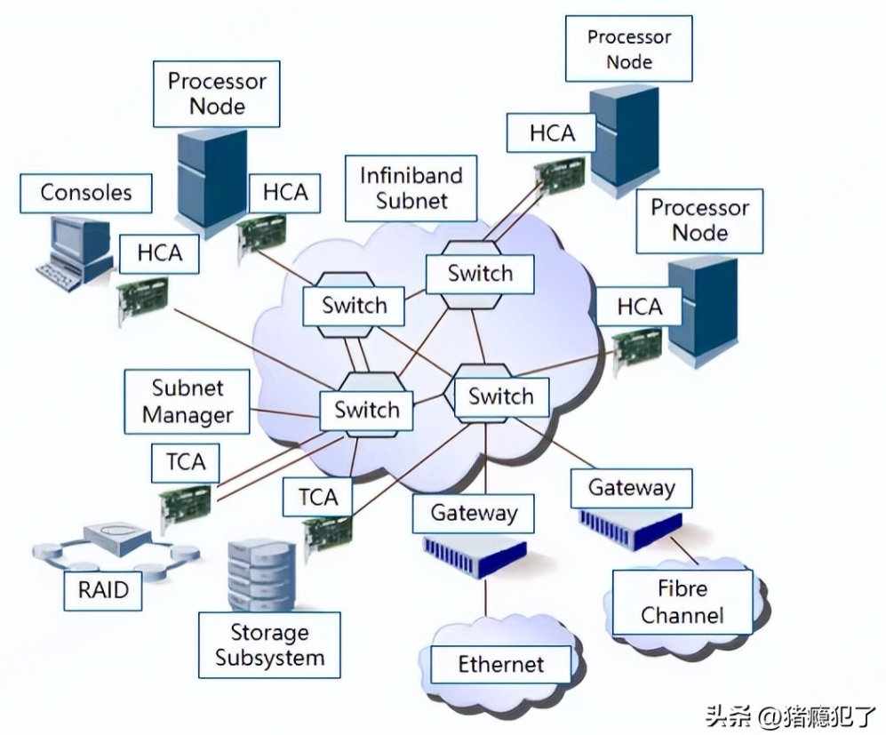

RoCE（RDMA over Converged Ethernet，融合以太网的远程直接内存访问）是一种在以太网上实现RDMA技术的标准。它允许网络中的设备通过直接访问彼此的内存来传输数据，从而减少了延迟并提高了性能。RoCE有两个主要版本：RoCE v1和RoCE v2。以下是这两个版本的主要区别和特点：

# RoCE v1

```bash
RoCE_v1 = IB in Ethernet

+-----------------+-----------------+-----------------+
|     Ethernet    |       IB        |       FCS       |
+-----------------+-----------------+-----------------+

IB
+-----------------+-----------------+-----------------+
|       GRH       |       BTH       |     Payload     |
+-----------------+-----------------+-----------------+
```

1. **网络类型** : RoCE v1基于二层以太网协议，仅在同一个广播域内运行
2. **路由支持** : 不支持跨子网的路由
3. **拥塞控制** : 没有内置的拥塞控制机制，依赖于底层网络的质量（例如，数据中心内的低延迟、低丢包率环境）
4. **封装方式** : 使用以太网帧直接封装RDMA报文（**Ethernet_type=0x8915** ）

# RoCE v2

```bash
RoCE_v2 = IB in UDP

+-----------------+-----------------+-----------------+-----------------+-----------------+
|     Ethernet    |       IP        |       UDP       |       IB        |       FCS       |
+-----------------+-----------------+-----------------+-----------------+-----------------+

IB
+-----------------+-----------------+
|       BTH       |     Payload     |
+-----------------+-----------------+
```

1. **网络类型** : RoCE v2基于三层网络的IP协议，可以在IP网络上传输，跨子网运行
2. **路由支持** : 支持跨子网的路由，扩展了适用范围
3. **拥塞控制** : 引入了基于IP网络的拥塞控制机制，改进了对大规模网络的支持
4. **封装方式** : 使用UDP/IP封装RDMA报文，使其可以在任何IP网络上传输（**UDP_dport=4791** ）

# InfiniBand



IB（InfiniBand，直译为"无限带宽"），部署图如上所示（HCA/TCA为IB的专有硬件），各个节点的信含义如下：

* HCA（Host Channel Adapters）：负责将主机与RDMA网络连接的硬件网卡
* TCA（Target Channel Adapters）：用于存储设备的硬件网卡
* Switch：交换机，在相同的子网中转发IB报文
* Routers/Gateway：路由器/网关，在不同的子网中转发IB报文

# GRH（Global Route Header）

```bash
+-+-+-+-+-+-+-+-+-+-+-+-+-+-+-+-+-+-+-+-+-+-+-+-+-+-+-+-+-+-+-+-+
|Version| Traffic Class |             Flow Label                |
+-+-+-+-+-+-+-+-+-+-+-+-+-+-+-+-+-+-+-+-+-+-+-+-+-+-+-+-+-+-+-+-+
|         Payload Length        |  Next Header  |   Hop Limit   |
+-+-+-+-+-+-+-+-+-+-+-+-+-+-+-+-+-+-+-+-+-+-+-+-+-+-+-+-+-+-+-+-+
|                                                               |
+                                                               +
|                                                               |
+                         Source GID                            +
|                                                               |
+                                                               +
|                                                               |
+-+-+-+-+-+-+-+-+-+-+-+-+-+-+-+-+-+-+-+-+-+-+-+-+-+-+-+-+-+-+-+-+
|                                                               |
+                                                               +
|                                                               |
+                         Destination GID                       +
|                                                               |
+                                                               +
|                                                               |
+-+-+-+-+-+-+-+-+-+-+-+-+-+-+-+-+-+-+-+-+-+-+-+-+-+-+-+-+-+-+-+-+
```

* **Version (4 bits)** : 版本号
* **Traffic Class (8 bits)** : 流量类别，用于区分不同的服务质量（QoS）
* **Flow Label (20 bits)** : 流标签，用于标识特定的数据流
* **Payload Length (16 bits)** : 负载长度，以字节为单位
* **Next Header (8 bits)** : 下一层协议的类型
* **Hop Limit (8 bits)** : 跳数限制，表示数据包可以通过的最大路由器数量
* **Source GID (128 bits)** : 源全局标识符，标识数据包的源地址
* **Destination GID (128 bits)** : 目的全局标识符，标识数据包的目的地址

# BTH（Base Transport Header）

```bash
+-+-+-+-+-+-+-+-+-+-+-+-+-+-+-+-+-+-+-+-+-+-+-+-+-+-+-+-+-+-+-+-+
|   OpCode      |S|M|PC | Tver  |            P_Key              |
+-+-+-+-+-+-+-+-+-+-+-+-+-+-+-+-+-+-+-+-+-+-+-+-+-+-+-+-+-+-+-+-+
|               |              Destination QP                   |
+-+-+-+-+-+-+-+-+-+-+-+-+-+-+-+-+-+-+-+-+-+-+-+-+-+-+-+-+-+-+-+-+
|A|             |          Packet Sequence Number               |
+-+-+-+-+-+-+-+-+-+-+-+-+-+-+-+-+-+-+-+-+-+-+-+-+-+-+-+-+-+-+-+-+
```

* **OpCode (8 bits)** : 表示具体的RDMA操作，如SEND、READ、WRITE等
* **S (1 bit)** : Solicited Event Indicator，用于指示是否请求对方主机生成事件通知
* **M (1 bit)** : Migration Request，用于指示是否请求QP的迁移
* **Pad Count (2 bits)** : 数据包填充字节数，以确保数据对齐
* **Tver (4 bits)** : 传输头版本号，通常为0
* **P_Key (16 bits)** : 用于分区访问控制的键值
* **Destination QP (24 bits)** : 目标队列对标识符，用于唯一标识目的队列对
* **A (1 bit)** : Acknowledge Request，表示是否需要对方确认接收
* **PSN (24 bits)** : 数据包序列号，用于数据包的排序和确认
