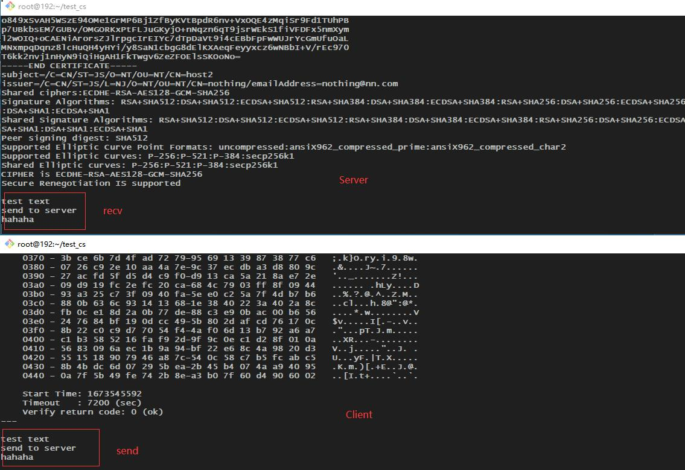

# Server端

```bash
openssl s_server \
	-accept 443 \
	-cert server.crt \
	-key server.key \
	-Verify 1 \
	-CAfile cafile.crt \
	-cipher ECDHE-RSA-AES128-GCM-SHA256 \
	-tls1_2
```

-accept 接受指定端口连接

-cert 发送给对端的身份证书

-key 本端私钥

-Verify 证书的验证深度

-CAfile 验证对端证书使用的CA文件

-cipher 会话使用的加密套件

-tls1_2 使用tls1.2协议

# Client端

```bash
openssl s_client \
	-connect 127.0.0.1:443 \
	-cert client.crt \
	-key client.key \
	-CAfile cafile.crt \
	-cipher ECDHE-RSA-AES128-GCM-SHA256 \
	-tls1_2
```

-connect 要连接的主机及端口号

-cert 发送给对端的身份证书

-key 本端私钥

-CAfile 验证对端证书使用的CA文件

-cipher 会话使用的加密套件

-tls1_2 使用tls1.2协议

# C/S通信

互相校验证书并进行会话协商后建立通信，Client/Server之间可以互相发送消息：


