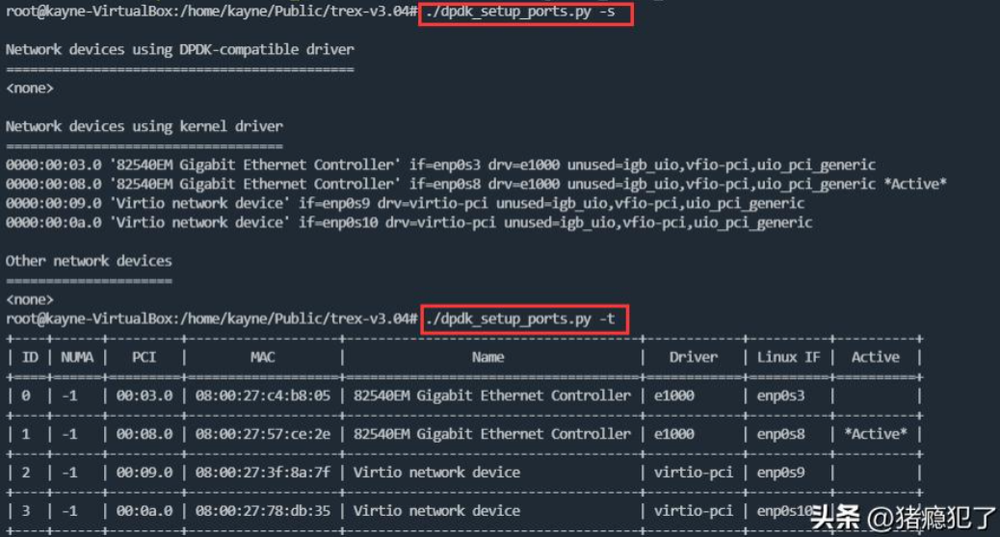
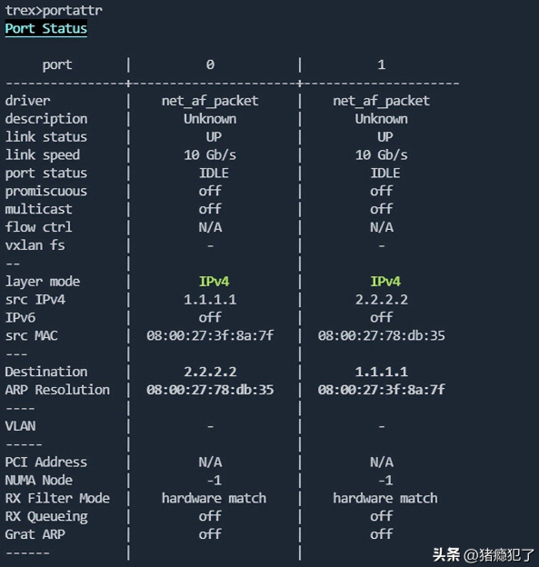
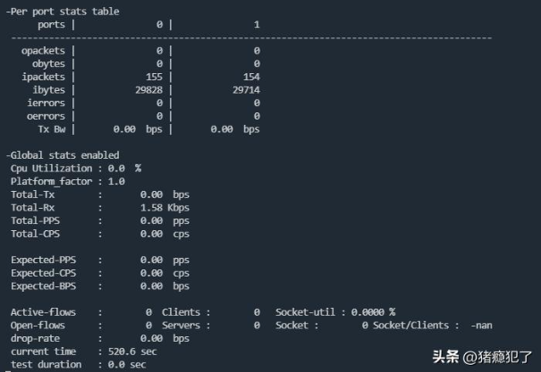
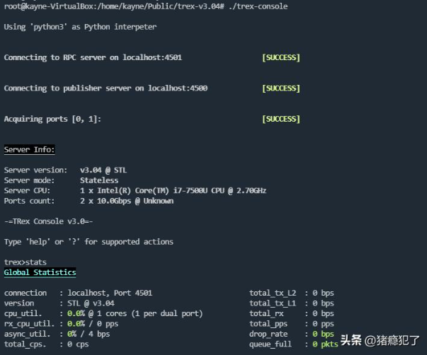
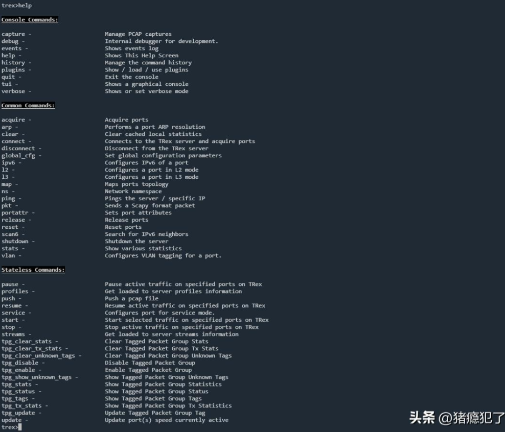
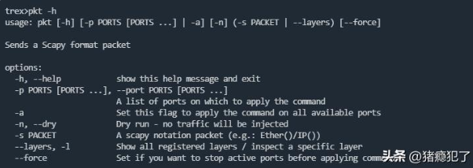
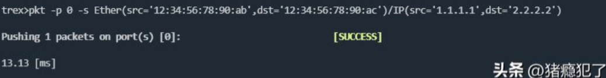

# trex概述

trex是cisco的一款基于dpdk的网络测试工具（测试仪）。使用scapy来构造数据包（便捷性），使用dpdk来发送数据包（高性能）。

trex包括服务端（t-rex-64）和客户端（trex-console），图形化界面的客户端（tui）这里不介绍。

trex下载地址：wget --no-check-certificate
https://trex-tgn.cisco.com/trex/release/v2.94.tar.gz

# t-rex-64

**1、/etc/trex_cfg_yaml配置**

```yaml
### Config file generated by dpdk_setup_ports.py ###
- version: 2
  interfaces: ['enp0s9', 'enp0s10']
  port_info:
    - ip: 1.1.1.1
      default_gw: 2.2.2.2
    - ip: 2.2.2.2
      default_gw: 1.1.1.1
```

interfaces为网卡名称，可以通过ifconfig命令获取网卡名称（此时使用内核驱动），也可以直接指定PCI号（此时使用
uio_pci_generic/vfio/igb_uio通用驱动）。当指定PCI号时，可以使用dpdk_setup_ports.py -s或-t查看网卡的状态。



port_info为网卡配置：ip为该网口本身的ip，default_gw为网关ip，src_mac为该网卡本身的mac，dest_mac为网关的mac。可以在trex-console命令产生的交互式界面中使用portattr命令查看。



**2、使用方法**

**t-rex-64 [mode]**

-f 文件配置模式（yaml），运行在stateful有状态模式下

-i 交互式模式，运行在stateless无状态模式下

--stl 使用stateless无状态模式

--emu 启用emu服务器

--scapy-server 启用scapy服务器

--no-scapy-server 禁用scapy服务器

**3、使用举例**

```bash
./t-rex-64 -i –no-scapy-server
```



# trex-console

**1、使用方法**

**trex-console**

-s 指定trex服务器的地址，默认为localhost

-p 指定端口地址，默认4501

-r 以只读模式打开

-t 图形化界面打开（前提是终端支持图形化界面）

**2、使用举例**

```bash
./trex-console
```



**3、交互操作**

使用trex-console命令进行交互式界面后，可以输入`help`查看帮助信息，对于help显示的命令，也可以继续使用-h查询其使用方法。



比如使用`pkt -h`查看pkt命令的使用方法：



再比如使用pkt命令向0号端口发包：

```bash
pkt -p 0 -s Ether(src='12:34:56:78:90:ab',dst='12:34:56:78:90:ac')/IP(src='1.1.1.1',dst='2.2.2.2')
```


