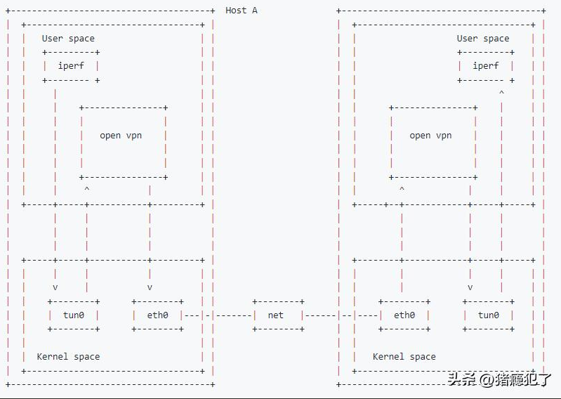
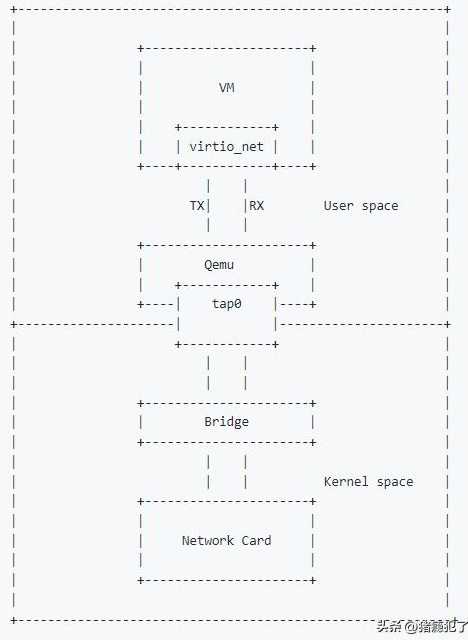

# TUN&TAP设备

TUN&TAP是Linux内核的虚拟网卡设备。

TUN是三层设备，处理IP数据包，没有MAC地址; TAP是二层设备，处理以太帧，有MAC地址。

TUN&TAP通过读写`/dev/net/tun`设备，用于在用户空间和内核空间之间传递数据（ip数据包/以太帧）。

# TUN的典型应用场景?

TUN设备主要用作openVPN场景的虚拟网卡，用于VPN设备和openVPN之间的通信。



# TAP的典型应用场景?

TAP设备主要用作虚机的虚拟网卡，用于虚机和内核协议栈通信。



# TUN&TAP实验

可以通过以下命令创建TUN&TAP设备：

```bash
ip tuntap add dev tun0 mod tun

ip tuntap add dev tap0 mod tap
```

也可以在C码中使用open函数打开/dev/net/tun文件来创建一个TUN&TAP设备。这里以C码为例，创建一个tap0虚拟设备：

```c
#include <fcntl.h>
#include <linux/if_tun.h>
#include <net/if.h>
#include <stdio.h>
#include <stdlib.h>
#include <sys/ioctl.h>
#include <sys/stat.h>
#include <sys/types.h>
#include <unistd.h>

int main(int argc, char *argv[])
{
	int err;
	int nread;
	char buffer[1500];
	char clone_dev[] = "/dev/net/tun";

	// 创建 tun 设备
	int fd = open(clone_dev, O_RDWR);
	if (fd < 0)
		return -1;

	struct ifreq ifr = {.ifr_flags = IFF_TAP | IFF_NO_PI};
	err = ioctl(fd, TUNSETIFF, (void *)&ifr);
	if (err < 0)
		return -1;

	printf("Open tun/tap device: %s for reading...\n", ifr.ifr_name);

	// 读取 tun 设备
	while (1) {
		nread = read(fd, buffer, sizeof(buffer));
		if (nread < 0)
			return -1;

		printf("Read %d bytes from tun/tap device\n", nread);
	}
	return 0;
}

```

运行结果（运行后需要使用`ip link set tap0 up`命令拉起该tap0设备）：

```bash
# gcc -o test test.c && ./test
Open tun/tap device: tap0 for reading...
Read 90 bytes from tun/tap device
Read 90 bytes from tun/tap device
Read 86 bytes from tun/tap device
Read 90 bytes from tun/tap device
Read 70 bytes from tun/tap device
Read 90 bytes from tun/tap device
Read 70 bytes from tun/tap device
```
