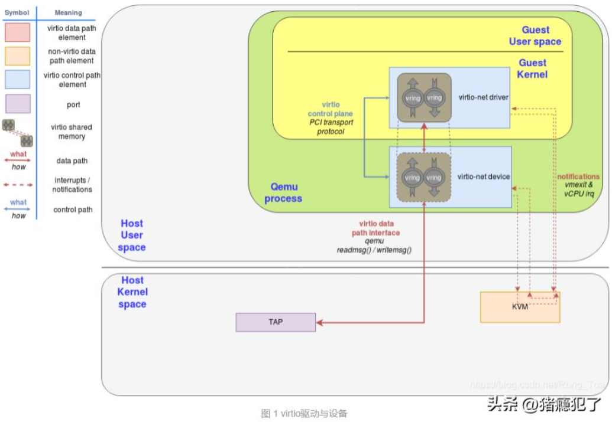
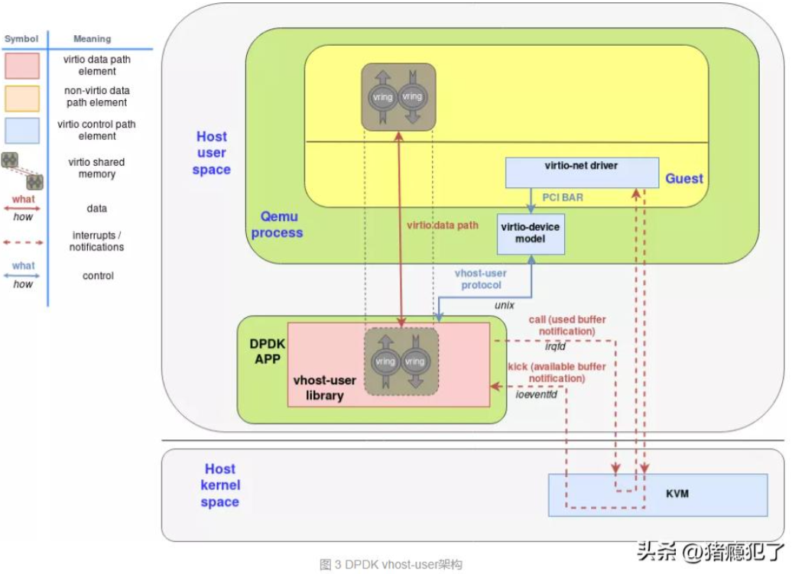
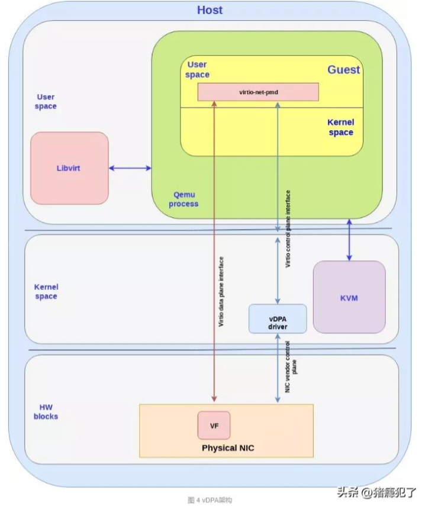

# 什么是驱动？

驱动全称为设备驱动程序，是添加到操作系统中的特殊程序，其中包含有关硬件设备的信息。此信息能够使计算机与相应的硬件设备进行通信。

驱动所在的位置如下：

```bash
        API                  DRIVE
APP  ----------->  Driver  ----------->  Device
```

上层应用直接或间接调用驱动函数，驱动再给设备发指令驱使设备运转，从而实现设备资源的利用。

# virtio协议模型

virtio协议为C/S结构，Client为前端驱动，Server为后端设备。前端驱动用于发现设备，接受来自虚拟机的请求，并通过virto协议传递给后端。后端设备主要用于处理虚拟机的请求，并回复驱动程序。

# virtio后端演进

后端的演进方向如下所示：

```bash
qemu  ------->  vhost-kernel  ------->  vhost-user  ------->  vdpa
```

qemu：早期的virtio后端程序基于qemu模拟实现，该种方式下需要与内核频繁交互，系统调用开销大，效率低。



vhost-kernel：将virtio后端的数据处理逻辑放到内核处理，qemu只负责对设备的模拟。


vhost-user：将virtio后端的数据处理逻辑放在host的用户态空间处理。



vdpa：分享控制面和数据面，控制面不变，数据面下沉至硬件处理。


