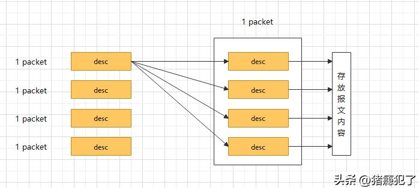

virtio存在两种描述符：直接描述符（Direct Descriptor）和间接描述符（Indirect Descriptor）。

简单的讲，直接描述符和间接描述符的区别在于：直接描述符封装的是报文，间接描述符封装的是描述符本身。

直接描述符里面直接存放报文，内容包括报文的起始地址，报文的长度，描述符状态信息等。直接描述符的示意图如下：

间接描述符有点像内核的内存页表，进行了分级管理，不同的是间接描述符最多分两级：第一级描述符指向存放报文的其它描述符，包括描述符的起始地址，描述符的个数等; 第二级描述符存放报文内容，包括报文的起始地址，报文的长度，描述符状态信息等。间接描述符的优势在于：无论是单帧还是巨帧，都只需要一个描述符来表示。间接描述符的示意图如下：

