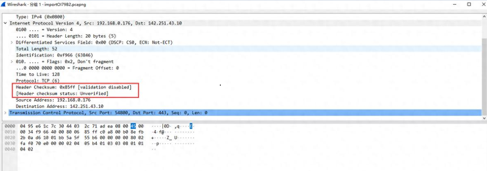
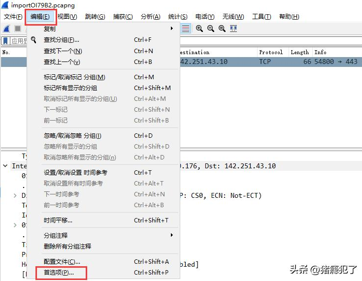
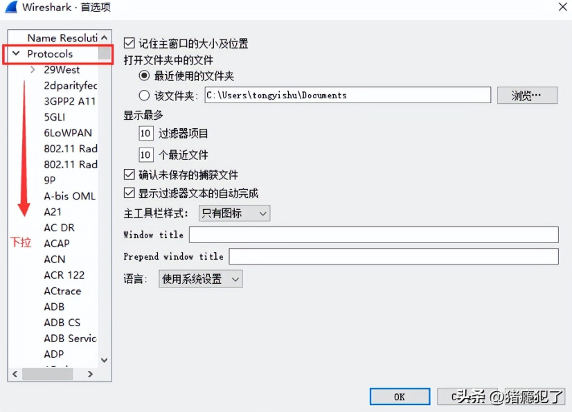
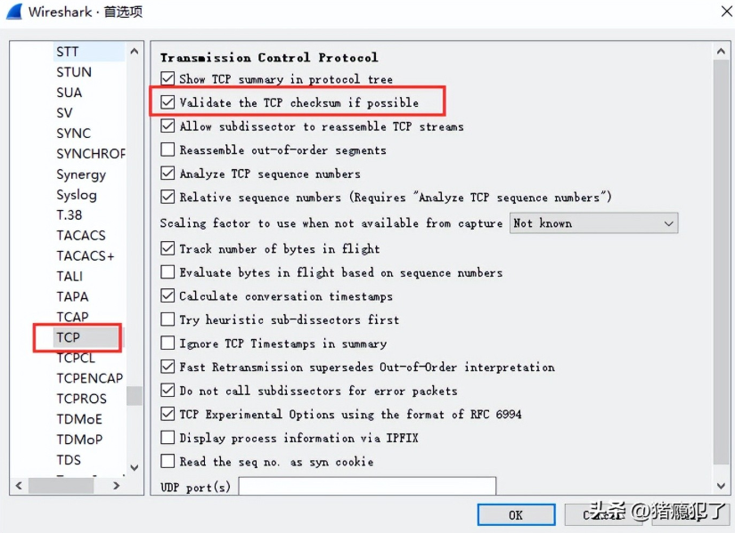
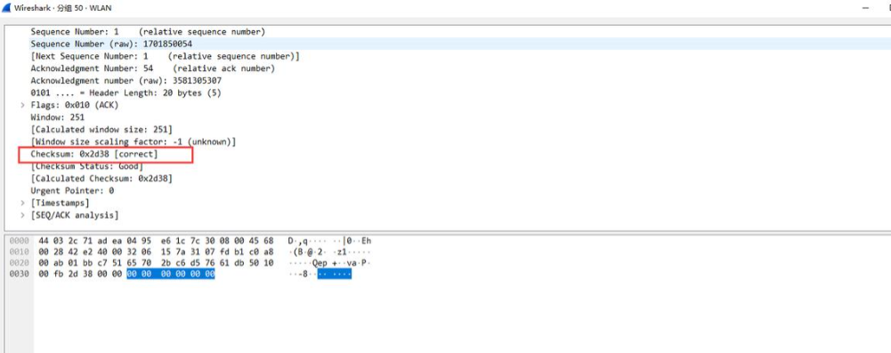

# 遇到的问题

使用wireshark分析报文时，发现tcp头的checksum的状态为unverifed（未校验的）。一种方法自己按照tcp/udp的checksum计算方法，手动进行计算并比较，但这种方法比较麻烦和费力。wireshark提供了checksum的自动校验功能，该功能在默认的情况下是关闭的，因此需要我们手动打开它。

# 解决方法

打开checksum校验的操作步骤如下：

**一、打开"编辑"->"首选项"标签。**

**二、从"Protocols"中找到"TCP"标签，如果需要打开UDP的checksum，则找到"UDP"标签。**

**三、勾选"Validate the TCP checksum if possible"选项，点击"OK"即可。**

**四、重启wireshark，再分析报文内容时，就可以看到checksum的正确与否了：如果checksum正确，显示的状态为"correct"，不正确则显示为"incorrect"。**

