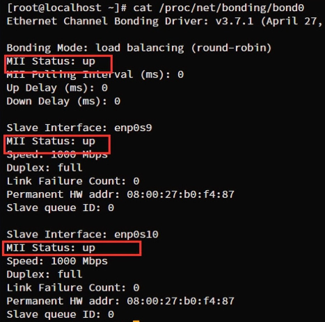

# 什么是bond

Bond是将多块网卡绑定成一块逻辑网卡的技术，通过组bond可以实现负载均衡和链路备份等功能。Linux内核自带bond模块，为用户提供bond技术。

# 加载内核bonding模块

`modinfo bonding` 查看内核的bonding模块信息。

`modprobe bonding` 加载bonding模块

`lsmod | grep bondig` 查看内核是否已经加载bonding模块

# 创建bond

保证有两张同类型的网卡，我这里是enp0s9、enp0s10（可以通过`ip link`命令查看）

* 停用网卡

```bash
ip link set enp0s9 down
ip link set enp0s10 down
```

* 创建bond逻辑网卡

```bash
echo +bond0 > /sys/class/net/bonding_masters
```

* 创建bond的成员口

```bash
echo +enp0s9 > /sys/class/net/bond0/bonding/slaves
echo +enp0s9 > /sys/class/net/bond0/bonding/slaves
```

* 启用bond口

```bash
ip link set bond0 up
```

* 查看bond的状态

```bash
cat /proc/net/bonding/bond0
```



# 修改bond逻辑口的属性

- 修改bond口的工作模式为lacp模式（也叫802.3ad），此操作要在添加成员口之前设置

```bash
echo 802.3ad > /sys/class/net/bond0/bonding/mode
```

- 修改bond的链路检测时间间隔为100毫秒

```bash
echo 100 > /sys/class/net/bond0/bonding/miion
```

类似的，`/sys/class/det/bond0/bonding/`目录下还有很多属性可以自行设置。

# bond的七种工作模式

**balance-rr（轮循策略）**

**active-backup（主备策略）**

**balance-xor（平衡策略）**

**broadcast（广播策略）**

**802.3ad（动态链路聚合）**

**balance-tlb（适配器传输负载均衡）**

**balance-alb（适配器适应性负载均衡）**
