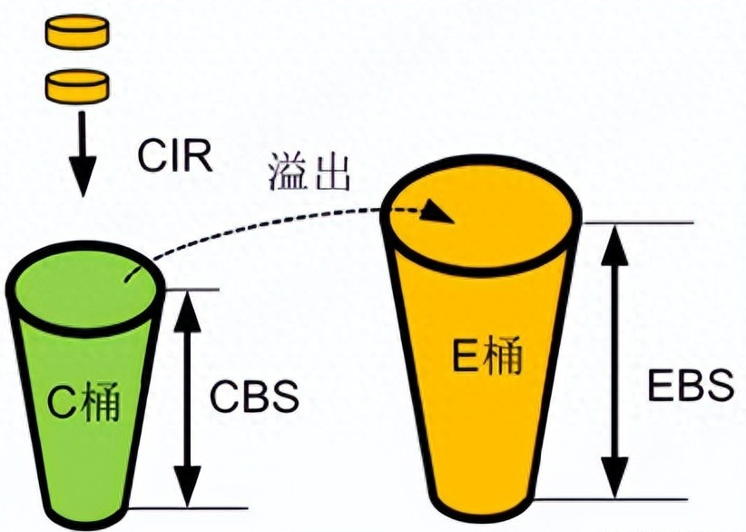
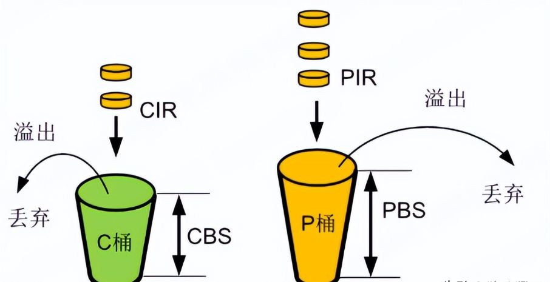

CAR（Committed Access Rate，承诺访问速率）是一种流量监管技术，用于限制网络设备的报文转发速率。

# 参数解释

CIR：Committed Information Rate，承诺信息速率

CBS：Committed Burst Size，承诺突发尺寸

EBS：Extended burst size，超额突发尺寸

PIR：Peak Information Rate，峰值信息速率

PBS：Peak Burst Size，峰值突发尺寸

# 单速单桶

使用cir、cbs作为参数：单速指cir，单桶指cbs。

单速单桶的令牌添加方式和流量评估规则参见单速双桶，单速单桶是单速双桶EBS=0的特殊场景。

# 单速双桶

srTCM（single rate Three Color Marker，单速三色标记），使用CIR、CBS、EBS作为参数：单速指CIR，双桶为CBS、EBS。三色为绿、黄、红，绿色报文正常转发，黄色报文可自定义转发或丢弃，红色报文丢弃。详细参见RFC2697。

1、令牌添加方式：

单速双桶令牌添加方式比较简单，先以CIR的速率往C桶中添加令牌，当C桶容量到达CBS后（C桶满了），再以相同的速率往E桶中添加令牌（E桶的令牌用做以后临时超过CIR的突发流量），当E桶容量到达EBS后（E桶也满了），新产生的令牌将会被丢弃。初始状态下，C桶和E桶都是满的。

2、流量评估规则：

当报文到来后，直接与桶中的令牌数相比较，如果有足够的令牌就转发（通常用一个令牌关联一个比特），如果没有足够的令牌则丢弃或缓存。为方便表示，用Tc和Te表示桶中的令牌数量，Tc和Te初始化等于CBS和EBS。

色盲模式下，在对到达的报文（假设报文大小为B）进行评估时，遵循以下规则：

* 对于单速单桶（EBS=0）：
* 如果报文长度不超过C桶中的令牌数Tc，则报文被标记为绿色，且Tc=Tc-B；
* 如果报文长度超过C桶中的令牌数Tc，报文被标记为红色，Tc 值不变。
* 对于单速双桶（EBS≠0）：
* 如果报文长度不超过C桶中的令牌数Tc，则报文被标记为绿色，且Tc=Tc-B；
* 如果报文长度超过C桶中的令牌数Tc但不超过E桶中的令牌数Te，则报文被 标记为黄色，且Te=Te-B；
* 如果报文长度超过E桶中的令牌数Te，报文被标记为红色，但Tc和Te不变。

色敏模式下，在对到达的报文（假设报文大小为B）进行评估时，遵循以下规则：

* 对于单速单桶（EBS=0）：
* 如果报文已被标记为绿色但报文长度不超过C桶中的令牌数Tc，则报文被标记为绿色，且Tc=Tc-B；
* 如果报文已被标记为绿色且报文长度超过C桶中的令牌数Tc，则报文被标记为红色，Tc保持不变；
* 如果报文已被标记为黄色或红色，都直接将报文标记为红色，Tc保持不变；
* 对于单速双桶（EBS≠0）：
* 如果报文已被标记为绿色且报文长度不超过C桶中的令牌数Tc，则报文被标记为绿色，且Tc=Tc-B；
* 如果报文已被标记为绿色且报文长度超过C桶中的令牌数Tc但不超过E桶中的令牌数Te，则报文被标记为黄色，且Te=Te-B；
* 如果报文已被标记为黄色但报文长度不超过E桶中的令牌数Te，则报文被标记为黄色，且Te=Te-B；
* 如果报文已被标记为黄色且报文长度超过E桶中的令牌数Te，则报文被标记为红色，且Te保持不变；
* 如果报文已被标记为红色，直接将报文标记为红色，Tc和Te不变。

# 双速双桶

trTCM（two rate Three Color Marker，双速三色标记），使用CIR、CBS、PIR、PBS作为参数：双速为CIR、PIR，双桶为CBS、PBS。三色为绿、黄、红，绿色报文正常转发，黄色报文可自定义转发或丢弃，红色报文丢弃。详细参见RFC2698。

1、令牌添加方式：

初始状态时C桶和P桶都是满的。往C桶和P桶分别以CIR和PIR的速率填充令牌。因这两个令牌桶是相互独立的，当其中一个桶被填满时，这个桶新产生的令牌将会被丢弃，而另一个桶则不受影响，继续填充令牌。

2、流量评估规则：

双速率三色标记算法关注的是速率的突发，首先评估的是数据流的速率是否符合规定的突发要求，其规则是先比较P桶，再比较C桶。双速率三色标记算法也有色盲模式和色敏模式两种。为方便用Tc和Tp表示桶中的令牌数量，Tc和Tp初始化等于CBS和PBS。

色盲模式下，在对到达的报文（假设数据包大小为B）进行评估时，遵循以下规则：

* 如果报文长度超过P桶中的令牌数Tp，则报文被标记为红色，且Tc和Tp保持不变
* 如果报文长度不超过P桶中的令牌数Tp 但超过C桶中的令牌数Tc，则报文被标记为黄色，且Tp=Tp-B
* 如果报文长度不超过C桶中的令牌数Tc，报文被标记为绿色，且 Tp=Tp-B，Tc=Tc-B

色敏模式下，在对到达的报文（假设报文大小为B）进行评估时，遵循以下规则：

* 如果报文已被标记为绿色且报文长度超过P桶中的令牌数Tp，则报文被标记为红色，且Tp和Tc不变
* 如果报文已被标记为绿色且报文长度不超过P桶中的令牌数Tp但超过C桶中的令牌数Tc，则报文被标记为黄色，且Tp=Tp-B，Tc不变
* 如果报文已被标记为绿色且报文长度不超过C桶中的令牌数Tc，则报文被标记为绿色，且Tp=Tp-B，Tc=Tc-B
* 如果报文已被标记为黄色，则只比较P桶，如果报文长度超过P桶中的令牌数Tp，则报文被标记为红色，且Tp和Tc不变
* 如果报文已被标记为黄色，且报文长度不超过P桶的令牌数，则报文被标记为 黄色，且Tp=Tp-B，Tc不变
* 如果报文已被标记为红色，直接将报文标记为红色，Tc和Tp不变
