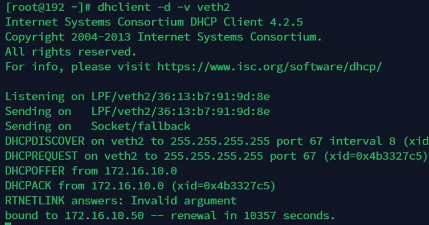
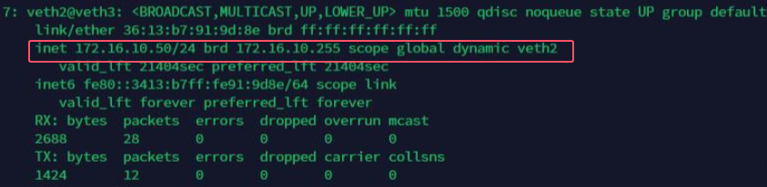

# 什么是DHCP

DHCP（动态主机配置协议）用于动态分配IP，使用UDP进行广播。

67号端口用于dhcp server进行监听，68号端口用于dhcp client发起连接。

# 用于专用网络的3个子网

这些网络为特殊保留，不会与互联网中的任何主机发生冲突。

192.168.0.0/16（subnet 192.168.0.0，netmask 255.255.0.0）

172.16.0.0/12（subnet 172.16.0.0，netmask 255.240.0.0）

10.0.0.0/8（subnet 10.0.0.0，netmask 255.0.0.0）

# 验证dhcpd与dhclient的交互

通过Linux网桥连接，dhcpd部署于veth0网卡，dhclient从veth2网上发送dhcp请求。组网图如下：

```bash
                                          +-------------------------------------+
                                          |                                     |
+--------------------------------+        +---------+                 +---------+        +---------------------------------+ 
|  veth0 (dhcpd 172.16.10.0/24)  +--------+  veth1  |      br0        |  veth3  +--------+ veth2 (dhcp-client, dynamic IP) |
+--------------------------------+        +---------+                 +---------+        +---------------------------------+ 
                                          |                                     |
                                          +-------------------------------------+
```

# 配置dhcpd

/etc/dhcp/dhcpd.conf写入以下配置：

```bash
ddns-update-style none;
ignore client-updates;
subnet 172.16.10.0 netmask 255.255.255.0 {
	range 172.16.10.50 172.16.10.150;
	option subnet-mask 255.255.255.0;
	option routers 172.16.10.0;
	option domain-name "my_subnet";
	option domain-name-servers 172.16.10.0;
	default-lease-time 21600;
	max-lease-time 43200;
}
```

# 添加虚拟网卡

```bash
ip link add veth0 type veth peer name veth1
ip link add veth2 type veth peer name veth3
```

# 为dhcpd所在网上设置ip

```bash
ip address add 172.16.10.0/24 dev veth0
```

# 添加网桥，并将虚拟网卡加入网桥

```bash
brctl addbr br0
brctl addif br0 veth1
brctl addif br0 veth3
```

# 启用所有网卡

```bash
ip link set veth0 up
ip link set veth1 up
ip link set veth2 up
ip link set veth3 up
ip link set br0   up
```

# 启动dhcpd服务

```bash
systemctl start dhcpd
```

# 使用dhclient为veth2动态分配ip

1、申请动态IP

```bash
dhclient -d -v veth2
```



2、查看veth2分配到了动态IP

```bash
ip addr show veth2
```


