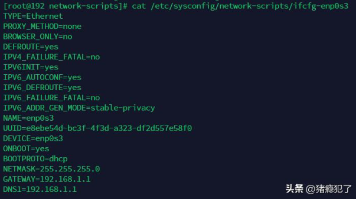

# 域名与IP的关系

一个IP实际上是可以同时对应多个域名（domain）的，比如在我的电脑上ping www.baidu.com，输出如下：

可以发现，www.baidu.com又叫www.a.shifen.com，二者都对应180.101.49.13这个IP。

一个域名理论上也是可以对应多个IP的，而在用户访问过程中，域名将指向某一个具体IP，并不会同时访问多个IP。但不同用户在不同地点访问同一个域名，可能会访问到不同的IP地址，但表象仍旧是这个域名。

# DNS服务

域名的存在是为了方便人的记忆，而主机间通信都是使用IP，DNS服务就是建立`[域名] -> [IP]`的映射关系。DNS服务一般位于网关上，服务器IP与网关IP相同。

在Red Hat系列操作系统上，如CentOS、RHEL、Fedora，可以通过网卡配置文件`/etc/sysconfig/network-scripts/ifcfg-xxx`来进行配置。

配置文件中GATEWAY为网关，DNS1为DNS服务器地址。类似的也可以配置如：DNS2=192.168.2.1，给网卡同时配置多个DNS服务器。
