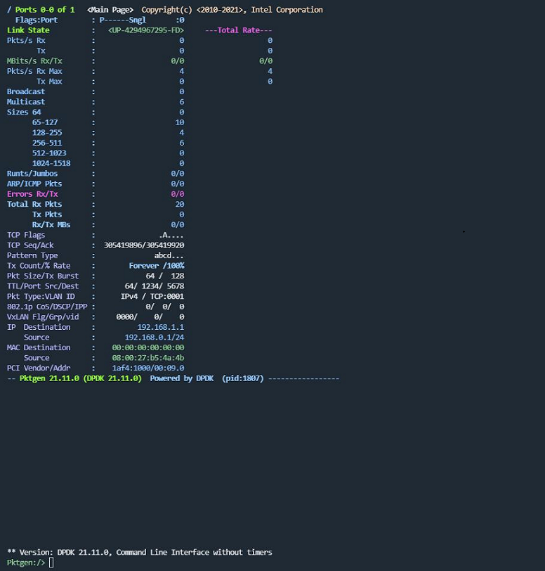

DPDK Pktgen (Packet Generator) 是一个高性能的包生成工具，专门用于网络测试和性能评估。它基于DPDK（Data Plane Development Kit）构建，能够生成和接收高吞吐量的网络流量，用于模拟和测试网络设备、应用程序的性能。

# 编译安装

dpdk-pktgen的编译和安装依赖dpdk，需要先安装好dpdk版本，这里我的配套关系如下：

```bash
dpdk版本：21.11
dpdk安装路径：/home/kayne/Public/dpdk-21.11/install

dpdk-pktgen版本：21.11.0
dpdk-pktgen安装路径：/home/kayne/Public/pktgen-dpdk/install
```

编译dpdk-pktgen：

```bash
export PKG_CONFIG_PATH=/home/kayne/Public/dpdk-21.11/install/lib/x86_64-linux-gnu/pkgconfig

git clone http://dpdk.org/git/apps/pktgen-dpdk -b pktgen-21.11.0

cd pktgen-dpdk

meson setup build --prefix=`pwd`/install --buildtype=debug \
    -Dc_args="-I/home/kayne/Public/dpdk-21.11/install/include -Wno-mismatched-dealloc" \
    -Dc_link_args="-L/home/kayne/Public/dpdk-21.11/install/lib/x86_64-linux-gnu -l:librte_net_bond.a"

meson compile -C build
meson install -C build
```

# 启动运行

启动运行时需要先配置好大页内存，并加载uio和igb_uio驱动（uio驱动内核自带，igb_uio驱动这里是我自己编译的，用于接管VirtualBox创建的virtio-net设备，pci号这里为0000:09.0）：

```bash
echo 512 > /proc/sys/vm/nr_hugepages
cat /proc/meminfo | grep -e "^Huge"

modprobe uio
insmod /home/kayne/Public/dpdk-kmods-e721c733cd24206399bebb8f0751b0387c4c1595/linux/igb_uio/igb_uio.ko
lsmod | grep uio

/home/kayne/Public/dpdk-21.11/install/bin/./dpdk-devbind.py -u 0000:00:09.0
/home/kayne/Public/dpdk-21.11/install/bin/./dpdk-devbind.py -b igb_uio 0000:00:09.0
/home/kayne/Public/dpdk-21.11/install/bin/./dpdk-devbind.py -s

export LD_LIBRARY_PATH=/home/kayne/Public/dpdk-21.11/install/lib/x86_64-linux-gnu
/home/kayne/Public/pktgen-dpdk/install/bin/pktgen -l 0-1 -a 0000:09.0 --log-level 7 -- -N -P -T -m "[1].[0]" -l pktgen.log
```

**环境抽象层参数（"--"分隔符之前的参数，具体参见dpdk eal的参数解析，这里只给出命令中出现的参数）：**

***-l*** 指定cpu的逻辑核
***-a*** 指定设备的bdf号（pci号）
***--log-level*** 指定日志等级

**自身应用层参数（"--"分隔符之后的参数）：**

***-N*** 使能NUMA支持
***-T*** 使能终端着色
***-P*** 使能所有端口的混杂模式（Promiscous）
***-l*** 指定日志文件
***-f*** 指定命令行脚本文件（.pkt or .lua），一般用于自动化测试
***-s*** 指定.pcap文件，从中提取报文特征，用于生成流
***-m*** 指定端口到CPU逻辑核的映射关系，以冒号":"分隔rx/tx队列，以点"."分隔CPU和端口，以"/"分隔单个CPU或单个端口。示例：

```bash
1.0, 2.1, 3.2                 - core 1 handles port 0 rx/tx,
                                core 2 handles port 1 rx/tx
                                core 3 handles port 2 rx/tx
1.[0-2], 2.3, ...             - core 1 handle ports 0,1,2 rx/tx,
                                core 2 handle port 3 rx/tx
[0-1].0, [2/4-5].1, ...       - cores 0-1 handle port 0 rx/tx,
                                cores 2,4,5 handle port 1 rx/tx
[1:2].0, [4:6].1, ...         - core 1 handles port 0 rx,
                                core 2 handles port 0 tx,
[1:2].[0-1], [4:6].[2/3], ... - core 1 handles port 0 & 1 rx,
                                core 2 handles port  0 & 1 tx
[1:2-3].0, [4:5-6].1, ...     - core 1 handles port 0 rx, cores 2,3 handle port 0 tx
                                core 4 handles port 1 rx & core 5,6 handles port 1 tx
[1-2:3].0, [4-5:6].1, ...     - core 1,2 handles port 0 rx, core 3 handles port 0 tx
                                core 4,5 handles port 1 rx & core 6 handles port 1 tx
[1-2:3-5].0, [4-5:6/8].1, ... - core 1,2 handles port 0 rx, core 3,4,5 handles port 0 tx
                                core 4,5 handles port 1 rx & core 6,8 handles port 1 tx
[1:2].[0:0-7], [3:4].[1:0-7], - core 1 handles port 0 rx, core 2 handles ports 0-7 tx
                                core 3 handles port 1 rx & core 4 handles port 0-7 tx
```

成功拉起后的界面如下：



# 常用命令


| 命令           | 说明                                                                               |
| ---------------- | ------------------------------------------------------------------------------------ |
| ls             | 查看pktgen内部命令eg. ls pktgen/bin                                                |
| on/off         | 开启/关闭page显示，on同时显示page和cli，off只显示cli                               |
| enable/disable | 使能/去使能特定的功能                                                              |
| help           | 显示帮助信息                                                                       |
| page           | 显示不同页面，eg. page stats                                                       |
| set            | 设置参数，eg. set 0 src ip 10.1.1.1/32                                             |
| range          | 设置发包时的数据包变化范围                                                         |
| start/stop     | 启动/停止发包                                                                      |
| dbg            | 诊断调试                                                                           |
| rate           | 控制发包速率                                                                       |
| pcap           | PCAP相关操作                                                                       |
| screen.clear   | 清屏                                                                               |
| sequence       | 配置发包的序列                                                                     |
| port           | 端口切换，比如在page stats页面下，执行port 2显示2号端口的相关信息，默认显示0号端口 |

# 发包模式

dpdk-pktgen有以下几种发包模式：


| 发包模式 | 解释说明                                            | 查看方式   |
| ---------- | ----------------------------------------------------- | ------------ |
| single   | 只发送单一报文，即smac/dmac/sip/dip等所有的项都固定 | page main  |
| range    | 控制smac/dmac/sip/dip等在一定范围内变化，步长可控制 | page range |
| random   | 根据报文内bit位的偏移设置掩码，随机修改报文内容     | page rnd   |
| sequence | 按照指定序列发包，每个序列最多发16个包              | page seq   |
| pcap     | 按照pcap文件中的包内容发包                          | page pcap  |

page stats用于查看硬件的统计信息。

page xstats用于查看软件的统计信息。

# 发包示例

```bash
set 0 proto udp
set 0 type ipv4
set 0 size 128
set 0 burst 1
set 0 count 10
set 0 src mac 00:11:22:33:44:55
set 0 dst mac 00:11:22:33:44:56
set 0 src ip 10.1.1.1/32
set 0 dst ip 10.1.1.2
set 0 sport 1024
set 0 dport 2048
start 0
```

# 官方文档

网页版：https://pktgen-dpdk.readthedocs.io/en/latest/getting_started.html

源码版：pktgen-dpdk/doc/source/


| 文档                                     | 说明                                                                   |
| ------------------------------------------ | ------------------------------------------------------------------------ |
| getting_started.rst                      | 安装/编译/配置pktgen                                                   |
| usage_eal.rst                            | dpdk环境抽象层参数（Environment Abstract Layer）                       |
| usage_pktgen.rst                         | pktgen自身的启动参数                                                   |
| commands.rst                             | pktgen内部自带的命令及介绍                                             |
| cli.rst                                  | pktgen的命令行架构（Command Line Interface）介绍，使用unix的目录树风格 |
| cli_lib.rst                              | cli的lib库，用于自定义命令行                                           |
| scripts.rst                              | 使用脚本自动化控制pktgen                                               |
| lua.rst                                  | lua脚本使用与示例                                                      |
| socket.rst                               | 使用socket（tcp）用于远程连接和控制pktgen                              |
| changes.rst<br/>copyright.rstlicense.rst | 修订信息<br/>版权信息许可证                                            |
