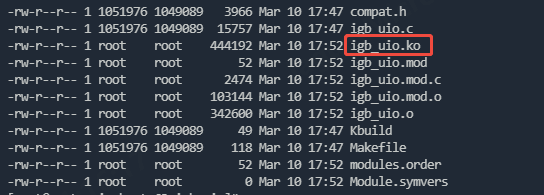

# 源码准备

dpdk 21.11下载：
https://codeload.github.com/DPDK/dpdk/zip/refs/tags/v21.11

dpdk-kmods下载：
https://git.dpdk.org/dpdk-kmods/snapshot/dpdk-kmods-cac86df858684f5db8b241a64ffe851f1939cfe0.zip

# 编译环境

ubuntu 22.04 LTS

gcc 11.3.0

ninja 1.10.1

meson 1.1.1

python 3.10.6

# dpdk编译

```bash
unzip dpdk-21.11.zip

cd dpdk-21.11

meson build

ninja -C build
```

编译完成后，build目录下会生成一系列so，及dpdk-testpmd、l2fwd等app工具。

# dpdk-kmods编译

```bash
unzip dpdk-kmods-e721c733cd24206399bebb8f0751b0387c4c1595.zip

cd dpdk-kmods-e721c733cd24206399bebb8f0751b0387c4c1595/linux/igbuio

make
```

编译完成后，该目录下会生成igb_uio.ko。



使用insmod igb_uio.ko加载igb_uio驱动前需要先modprobe uio驱动，因为igb_uio依赖于uio。
