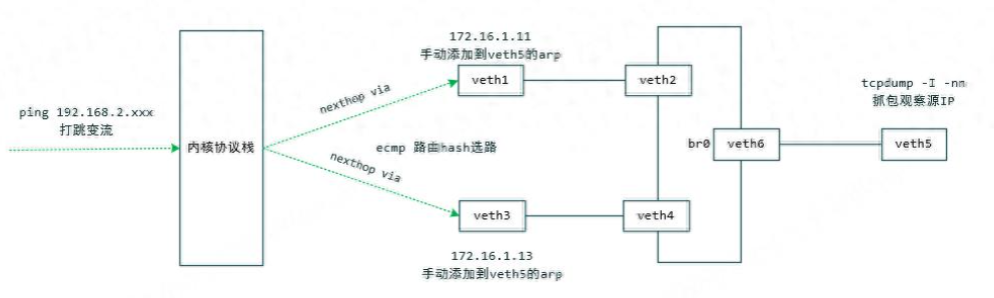

ECMP（Equal Cost Multi Path）等价多路径，又称等价路由。指到达同一个目的IP或者目的网段存在多条COST值相等的不同路由路径。在该情况下，ECMP会使用哈希算法进行选路：根据数据包的源IP、目的IP、源端口、目的端口计算出一个哈希值，然后再使用这个哈希值取余进行路由选路。

Linux上的ECMP小实验，使用内核的ecmp进行路由的hash选路：



1、创建3对veth（veth1~6）对和一个网桥（br0），其中veth1和veth3用于路由选路，veth5充当观察口，br0用于二层交换

```bash
ip link add veth1 type veth peer veth2
ip link add veth3 type veth peer veth4
ip link add veth5 type veth peer veth6
brctl addbr br0
```

2、将veth2、veth4、veth6加到网桥br0中，使veth1、veth3、veth5之间二层互通

```bash
brctl addif br0 veth2
brctl addif br0 veth4
brctl addif br0 veth6
```

3、给veth1和veth3配上IP

```bash
ip address add 172.16.1.11/32 dev veth1
ip address add 172.16.1.13/32 dev veth3
```

4、拉起所有设备

```bash
ip link set veth1 up
ip link set veth2 up
ip link set veth3 up
ip link set veth4 up
ip link set veth5 up
ip link set veth6 up
ip link set br0 up
```

5、添加到192.168.2.0/24网段的内核路由表，weight权重必须相同

```bash
ip route add 192.168.2.0/24 nexthop via 172.16.1.11 dev veth1 weight 1 nexthop via 172.16.1.13 dev veth3 weight 1
ip route show
```

6、在veth1和veth3上手动添加arp，以便报文能到veth5

```bash
for ((i = 0; i < 100; i++)); do arp -i veth1 -s 192.168.2.$i `cat /sys/class/net/veth5/address`;arp -i veth3 -s 192.168.2.$i `cat /sys/class/net/veth5/address`; done
```

7、使用内核协议栈打icmp的跳变流，1秒一个报文

```bash
for ((i = 0; i < 100; i++)); do ping -c 1 -W 1 192.168.2.$i; done
```

8、在veth5抓包，观察报文来自哪个设备

```bash
tcpdump -i veth5 -nn
```

9、删除相关设备，关联的路由表和arp表会自动删除

```bash
ip link set veth1 dwon
ip link set veth2 down
ip link set veth3 down
ip link set veth4 down
ip link set veth5 down
ip link set veth6 down
ip link set br0 down
ip link del veth1
ip link del veth3
ip link del veth5
brctl delbr br0
```

veth5的抓包结果如下，可以看到，发往192.168.2.0/24网段的报文，被veth1和veth3均等的进行了路由，根据目的IP的不同进行了哈希选路。


