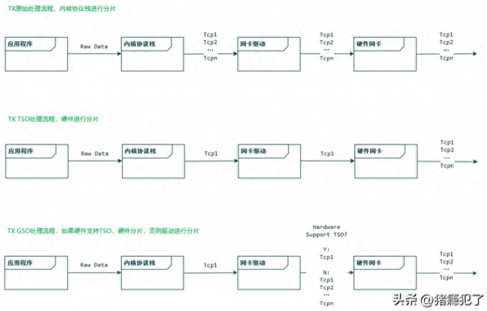
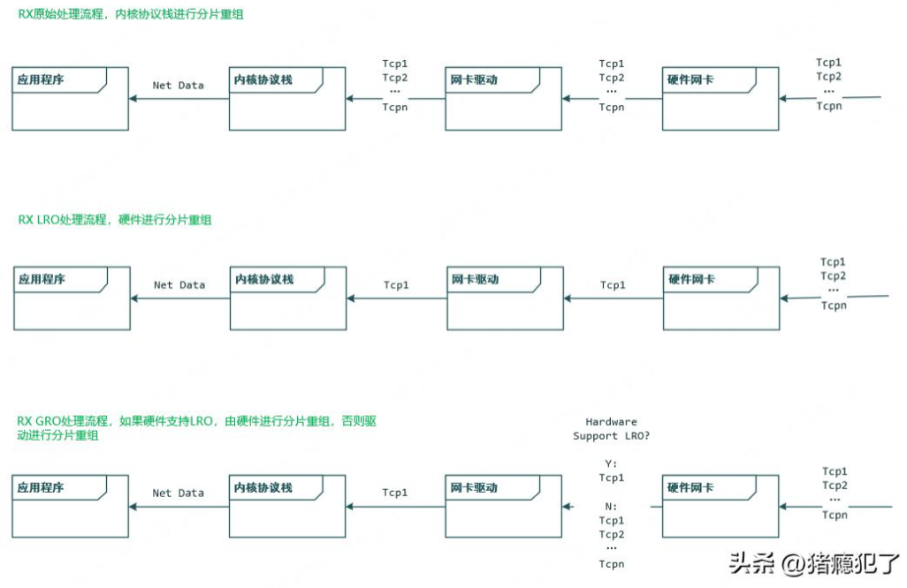

# 什么是硬件卸载？

将原本由软件协议栈做的事交给硬件网卡来做，从而减少Host CPU的负载，就叫做硬件卸载（offload）。并不是所有的功能都适合交给硬件网卡去做，当前常见的硬件卸载有：checksum卸载，tcp分片卸载。

# TX方向的TSO/GSO

TSO（TCP Segmentation Offload）：TCP分片卸载，将TCP的分片放在硬件网卡处理，而不是由协议栈处理。

GSO（Generic Segmentation Offload）：通用分片卸载，如果硬件网卡支持TSO，则将分片放在硬件处理，否则将分片的处理延迟到发送给硬件网卡之前，即驱动侧处理。



# RX方向的LRO/GRO

LRO（Large Receive Offload）：大包接收卸载，将TCP的分片重组放在硬件网卡处理，而不是由协议栈处理。

GRO （Generic Receive Offload）：通用接收卸载，如果硬件网卡支持LRO，则将分片重组放在硬件处理，否则将分片重组延迟到发送给内核协议栈之前，即驱动侧处理。



# tso/gso/lro/gro的开启与关闭

Linux上可以使用ethtool命令来开启和关闭相关特性：

1. 查看所有的卸载特性

```bash
ethtool -k eth0
```

2、开启gso特性（其它特性类似）

```bash
ethtool -K eth0 gso on
```

3、关闭gso特性（其它特性类似）

```bash
ethtool -K eth0 gso off
```
