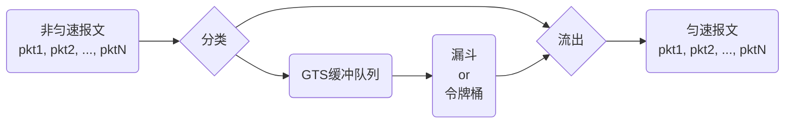

# gts目的

GTS(Generic Traffic Shaping，通用流量整形)，限制某类流量的流出速率，使这类流量的报文以比较均匀的速度向外发送。GTS通常使用漏斗或令牌桶来完成，当报文的发送速度过快时，首先在缓冲区进行缓存，在漏斗或令牌桶算法的控制下，再均匀地发送这些被缓冲的报文。因此，GTS的核心就是缓存报文和匀速流出。

# gts流程

当报文到达网络接口时，首先对报文进行分类，按照以下几种情况进行处理：

* 对于不参与流量整形的报文，直接发送
* 对于参与流量整形的报文，若存在整形队列，则报文直接进入队列，等待队列按照整形算法对报文进行调度
* 对于参与流量整形的报文，若不存在整形队列，则根据整形算法决定报文是否进行发送

当报文到达接口发现整形队列已满时，将报文丢弃。

# gts算法

* 漏斗（像漏斗一样，恒速流出）

**只控制报文流出的速度，不关注报文的流入** 。无论报文是以突发的方式流入还是匀速流入，报文都将被缓存，然后在漏斗算法的控制下匀速流出。如果漏斗满了，则丢弃报文。

* 令牌桶（以恒定的速度往桶里放入令牌，报文流出时会消耗桶里的令牌）

**只控制令牌的入桶速率，不关注报文的流出** 。遇到突发报文，会急速消耗桶里的令牌; 遇到匀速报文，会均匀消耗桶里的令牌。如果桶里的令牌用完了，则拒绝服务。

遇到比较大的流量，会迅速消耗令牌，导致长期维持在一个空桶的状态，因此报文的流出速率实际上由令牌的入桶速率控制。
