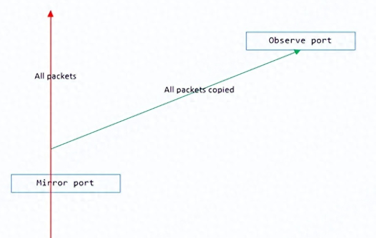
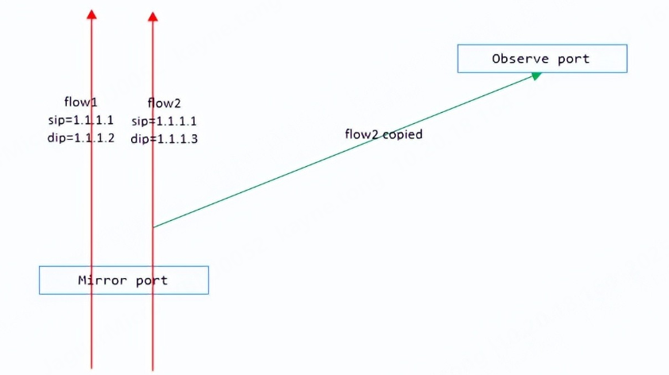

# 什么是端口镜像？

将一个端口上流经的报文，镜像复制到另一个端口，这个过程就叫做端口镜像。其中前者叫做镜像端口，后者叫做观察端口。

# 什么是流镜像？

什么是流（flow）？一般指网络流，具体介绍可参考百度百科的定义：https://baike.baidu.com/item/%E6%B5%81/9207989

狭义的网络流：在一段时间内，流经某个端口的报文五元组内容相同，即源端口号、目的端口号、协议号和源、目的IP地址相同，这样的一类流量称为一条流（flow）。

广义的网络流：不仅仅是五元组，甚至可以扩展到三元，四元，N元组。比如在五元组的基础上，再加上源MAC和目的MAC，就构成了七元组。

所谓的流镜像，就是将某个端口上的一条流（或多条）的报文，复制到另一个端口（观察口）。

