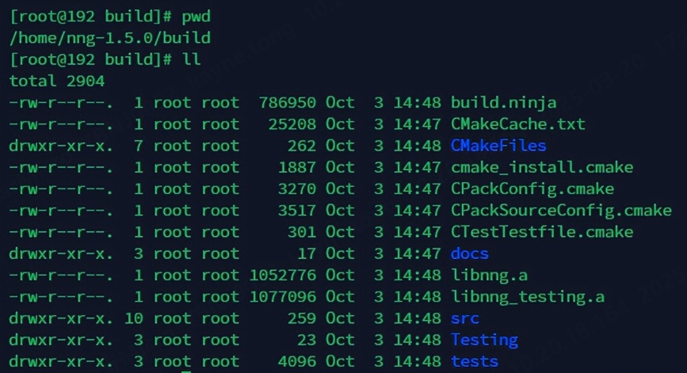

# 什么是NNG?

NNG是一个轻量级的、高性能的消息传递库，它的前身是nanomsg，在某种程度也可以说是ZeroMQ。

NNG提供了简单的API来解决常见的、反复出现的消息传递问题，如发布/订阅、rpc风格的请求/答复或服务发现等，将编程人员从连接管理、重试和其他常见考虑事项的细节中解放出来，因此他们可以专注于应用程序而不是管道。

NNG是用C语言实现的，只需要构建C99和CMake。它可以作为共享库或静态库构建，并且易于嵌入。

# NNG编译依赖

# Ninja的安装

Ninja是make的一种替代方案，比make更简单。由于源码编译Ninja安装的依赖太多，这里我直接下载的二进制文件进行安装：

```bash
wget https://github.com/ninja-build/ninja/releases/download/v1.11.1/ninja-linux.zip

unzip ninja-linux.zip

cp ninja /usr/bin/ninja
```

# CMake的安装

NNG要求CMake的版本 >= 3.13，因此需要下载新的CMake并安装：

```bash
wget https://github.com/Kitware/CMake/releases/download/v3.24.2/cmake-3.24.2-linux-x86_64.sh

sh cmake-3.24.2-linux-x86_64.sh

cp -rf cmake-3.24.2-linux-x86_64/* /usr/
```

# NNG的编译及安装

```bash
wget https://github.com/nanomsg/nng/archive/refs/tags/v1.5.0.tar.gz

tar-xzvf v1.5.0.tar.gz

cd nng-1.5.0

mkdir build

cd build

cmake -G Ninja ..

ninja

ninja install # 需要的话再进行安装，这里我只进行编译，未安装
```



编译完成之后可以发现build目录下生成了目标库文件**libnng.a** 。
