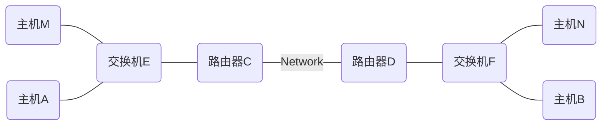

# 路由转发表项

* arp表，根据IP找MAC
* route表，根据IP找出端口

# 路由转发流程

A向B发送报文的流程如下（A和B不在同一局域网内，A只知道B的IP，不知道B的MAC）：

1、A封装报文时，发现缺少B的MAC，于是A查找自己的ARP表，结果没命中。于是A在局域网内发送ARP请求。

2、C收到ARP请求后，发现B可达，于是C将自己的MAC通过ARP应答返回给A。

3、A将报文封装后发送给C，并缓存ARP表项（B的IP，C的MAC）。

4、C收到报文后，查找路由表找到出端口，再查询出端口的ARP表，命中（没命中继续进行ARP请求流程），然后C根据ARP的查找结果，修改报文的目的MAC为D的MAC。

5、C将报文发送给D。

6、D收到报文后，查找路由表找到出端口，再查询出端口的ARP表，命中（没命中继续进行ARP请求流程），然后D根据ARP的查找结果，修改报文的目的MAC为B的MAC。

7、D将报文发送给B。

8、B收到报文，对数据进行处理。
