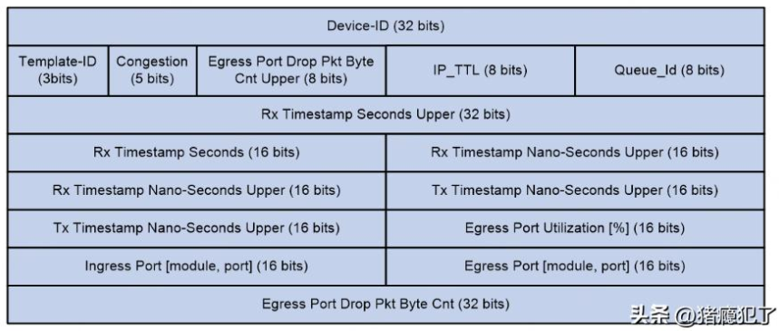

# 什么是Telemetry

Telemetry（遥测技术），一种远程的从物理设备或虚拟设备上高速采集数据的技术。被采集的网络设备通过推送模式（Push Mode），主动的、周期性的向采集器上送信息（比如网卡的统计信息，CPU的利用率，MEMORY的利用率，报文的转发路径及耗时情况）。

Telemetry网络模型如下：

* 网络设备：被监控的设备（eg.交换机/路由器/虚拟网卡/物理网卡）
* 采集器：用于接收和保存网络设备上报的监控数据
* 分析器：用于分析采集器接收到的监控数据，对数据进行处理，并以图形化界面的形式将分析结果展现给用户
* 控制器：通过netconf/openflow等方式向网络设备下发配置，实现对网络设备的管理

Telemetry的实现方式有以下4种：

* gRPC（Google Remote Procedure Call，Google远程过程调用）
* INT（In-band Network Telemetry，带内遥测）
* Telemetry Stream（流采样）
* ERSPAN（Encapsulated Remote Switch Port Analyzer，封装远程端口镜像）

# 基于gRPC的Telemetry

基于gRPC的Telemetry技术主要用来**采集设备的接口流量统计、CPU、告警等数据** 。gRPC网络采用C/S模型，各节点单独上送采集器。

dial-in模式：设备作为gRPC服务端，采集器作为gRPC客户端。由采集器主动向设备发起gRPC连接，拉取需要采集的数据信息。

dial-out模式：设备作为gRPC客户端，采集器作为gRPC服务端。由设备主动向采集器发起gRPC连接，推送需要采集的数据信息。

# 基于INT的Telemetry

INT（In-band Network Telemetry）是一种由设备向采集器推送（Push）数据的网络监控技术，主要用来**采集报文经过的路径和报文传输时延等数据平面信息** 。INT监控粒度为单个报文。各节点采集信息，并由尾节点汇总上送采集器。

**INT报文头Probe Header格式如下：**

* Probe Maker：设备通过此字段识别INT报文，目前固定填充为0xaaaaaaaabbbbbbbb
* Version：目前固定填充为0x01
* Message Type：消息类型，目前固定填充为0x01
* Flags：保留字段，目前固定填充为0x0000
* Telemetry Request Vector：目前固定填充为0xffffffff
* Hop Limit：最大跳数
* Hop Count：报文已经过网络节点数量
* Must Be Zero：目前固定填充为全0
* Maximum Length：INT报文采集数据的最大长度，单位为字节
* Current Length：INT报文采集数据的当前长度，单位为字节
* Sender`s Handle：由首节点自动填充，采集器根据此字段识别INT流，唯一标识流
* Sequence Number：INT流中报文的序号，同一个流中报文的唯一标识

**INT监控信息的metadata格式如下：**

* Device-ID：设备ID
* Template-Id：保留字段，目前固定填充为000
* Congestion：拥塞标志位，即ECN。高3位固定填充0，低2位为ECN域
* Egress Port Drop Pkt Byte Cnt Upper：出接口丢包数，单位为字节，目前固定填充为0x00
* IP_TTL：报文的TTL值
* Queue-Id：出接口队列ID，目前固定填充为0x00
* Rx Timestamp Seconds Upper/Rx Timestamp Seconds：入接口时间戳，单位为秒
* Rx Timestamp Nano-Seconds Upper：入接口时间戳，单位为纳秒
* Tx Timestamp Nano-Seconds Upper：出接口时间戳，单位为纳秒
* Egress Port Utilization [%]：出接口利用率，目前固定填充为0x0000
* Ingress Port [module, port]：入接口标识
* Egress Port [module, port]：出接口标识
* Egress Port Drop Pkt Byte Cnt：出接口丢包数，单位为字节，目前固定填充为0x00000000

# Telemetry Stream

Telemetry Stream是一种**基于流** 的网络流量监控技术，通过**对特定的流进行报文采样** ，进而分析出流量的传输路径和传输时延。各节点单独上送采集器。

**Telemetry Stream填充头格式如下：**

* Version，32bit，Telemetry Stream版本，目前固定为1
* Src MID，8bit，原始流量的源接口模块ID（Source Module ID）
* Src Port，8bit，原始流量的源端口号
* Dst MID，8bit，原始流量的目的接口模块ID（Destination Module ID）
* Dst Port，8bit，原始流量的目的端口号
* Flags，9bit，标志位（1表示是，0表示否），比特位从左到右依次代表： Source_sample（1bit）：是否为基于Ingress port的Telemetry Stream采样 Dest_sample（1bit）：固定为0 Flex_sample（1bit）：是否为基于流的Telemetry Stream采样 Mcast_sample（1bit）：是否为组播报文采样 Discarded（1bit）：采样报文送往本地CPU处理时是否被丢弃 Truncated（1bit）：固定为0（不剪裁）。目前所有采样都复制原报文进行UDP封装 Dest_port_encoding（3bits）： 000：CPU之间通信的控制帧 001：目的地址已解析的二层或三层单播报文 010：组播报文、未知单播报文或未知组播报文，发往VLAN内所有端口 011：二层组播报文，发往组播组的所有端口 100：IP组播报文，发往组播组的所有端口 101、110、111：预留值
* Reserved，7bit，预留字段
* User metadata，16bit，可定制的用户信息
* Sequence number，32bit，序列号

**时间戳相关域段含义如下：**

* Time，48bit，从PTP模块获取的时间，包含16bits秒位和32bits纳秒位
* Reserved，8bit，预留字段
* Origin ID，23bit，时间戳所在报文的源设备信息，Telemetry Stream的设备ID被拆分为2个16bits，分别存储在入接口时间戳和出接口时间戳的本字段的前16bits中
* Rx_Tx，1bit，方向标记，取值包括：0代表Receiver，即入接口时间戳，1代表Transmitter，即出接口时间戳
* FCS，32bit，帧校验序列（Frame Check Sequence）

# 基于ERSPAN的Telemetry

ERSPAN是一种远程端口镜像技术，它能够将指定端口上的报文做镜像，并将其封装为GRE报文，发送到远端采集器。用户可以根据实际需求定义待镜像的报文，例如镜像TCP三次握手报文以便监控TCP连接建立情况、镜像RDMA信令报文以便监控RDMA会话状态。需要说明的是，**对报文的镜像操作可以基于端口，也可以基于端口上的流** ，这取决于用户对哪种报文感兴趣。

# 参考链接

详细参见：
https://www.h3c.com/cn/Service/Document_Software/Document_Center/Home/Public/00-Public/Learn_Technologies/White_Paper/Telemetry_White_Paper-3559/#_Toc102752023
