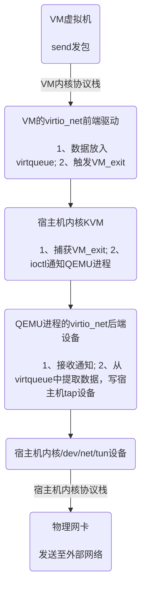

# 什么是驱动？

驱动全称为设备驱动程序，是添加到主机操作系统中的特殊程序，其中包含有关硬件设备的信息。此信息能够使计算机与相应的硬件设备进行通信。驱动所在的位置如下：

```bash
        API                  CMD
APP  ----------->  Driver  ----------->  Device
```

上层应用直接或间接调用驱动函数，驱动再给设备发指令（ioctl）驱使设备运转，从而实现设备资源的利用。

# 什么是虚拟机？

从宿主机的角度来看，虚拟机本质上是一个通过QEMU命令启动的、用户态的、多线程的、宿主机进程。

```bash
├─ qemu-system-x86_64 (PID 123456)
   │
   ├── 主线程：处理设备模拟
   │
   ├── vCPU0线程：VM的"CPU0"
   │
   ├── vCPU1线程：VM的"CPU1"
   │
   └── 其他线程（如VNC、磁盘I/O）
```

# virtio_net协议模型

virtio_net协议为C/S结构，Client为前端驱动，Server为后端设备。

前端驱动位于VM中，用于发现后端设备，它接受来自虚拟机的请求，通过virto协议将数据传递给后端设备。

后端设备由于不断的演进，其所处位置也在不断变化，主要用于处理虚拟机的请求，回复前端驱动。

# virtio_net后端演进

后端的演进方向如下：

```bash
qemu virtio  ------->  vhost-kernel  ------->  vhost-user  ------->  vdpa
```

这一演进的本质是将网络数据处理从通用CPU逐步卸载到专用硬件。各种后端的差异如下：


| **技术**         | **数据路径**                                   | **性能关键点**             | **适用场景**             |
| ------------------ | ------------------------------------------------ | ---------------------------- | -------------------------- |
| **qemu virtio**  | VM → 宿主内核 → QEMU → 宿主内核 → 物理网卡 | 多次上下文切换，高延迟     | 开发测试，低负载环境     |
| **vhost-kernel** | VM → 宿主内核（vhost线程）→ 物理网卡         | 绕过QEMU，仍走内核协议栈   | 通用虚拟化               |
| **vhost-user**   | VM → 用户态进程（如ovs-dpdk）→ 物理网卡      | 用户态零拷贝，绕过内核     | SDN/NFV，高性能软件转发  |
| **vDPA**         | VM → 智能网卡硬件 → 物理网口                 | 硬件加速，接近物理网卡性能 | 云数据中心，超低延迟场景 |

以QEMU virtio为例：


