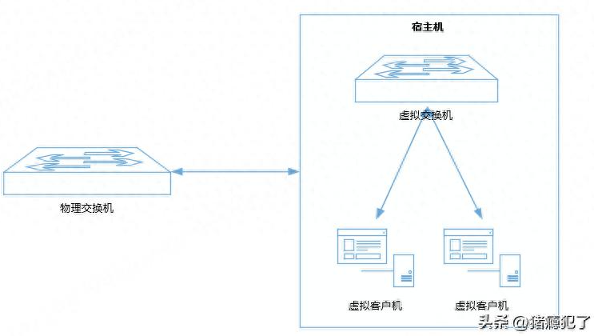

一般来讲，可以在3个地方给报文打上vlan标记，这3个位置分别为：外部的物理交换机**EST（External Switch Trunk）** ，宿主机内部的虚拟交换机**VST（Virtual Switch Trunk）** ，宿主机内部的虚拟客户机：**VGT（Virtual Guest Trunk）** 。

物理交换机/宿主机/虚拟机的关系如下图：

EST是将vlan_tag设置在物理交换机的端口上，而虚拟交换机和虚拟客户机上不做任何vlan设置（即将vlan_id设置为0），此时宿主机下所有虚拟机都属于同一个vlan;

VST是将vlan_tag设置在虚拟交换机的端口上，虚拟客户机上不做任何vlan设置（即将vlan_id设置为0），此时同一端口组下的所有虚拟机属于同一个vlan;

VGT是将vlan_tag设置在虚拟客户机的网卡上，进出网卡时去掉/打上vlan标记，此时一个虚拟机一个vlan_id。
