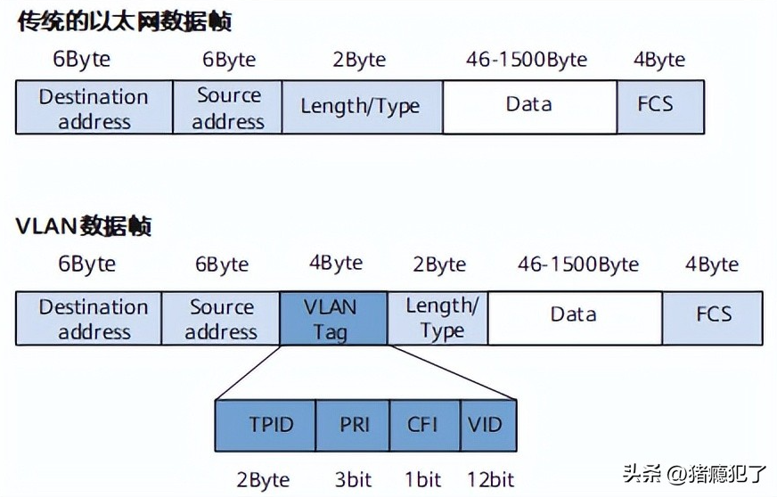

# 什么是vlan

VLAN（Virtual Local Area Network）即虚拟局域网，是将一个物理的LAN在逻辑上划分成多个广播域的通信技术。一个VLAN是一个广播域，VLAN内的主机间可以直接通信，而VLAN间则不能直接互通，这样广播报文就被限制在一个VLAN内。

# vlan tag与vlan ID

IEEE 802.1Q协议规定，在以太网数据帧（链路层）中加入4个字节的VLAN标签（即VLAN Tag），用来标识VLAN信息。



TPID（Tag Protocol IDentifier）为协议类型：

* IPv4：0x0800
* IPV6：0x86dd
* ARP：0x0806
* PPPoE：0x8864
* 802.1Q tag：0x8100
* MPLS Label：0x8847

PRI（Priority）：用户报文的优先级，3bit，取值范围为1~7。

CFI（Canonical Format Indicator）：规范格式标识符，1bit，0表示以规范格式封装，1表示未按规范格式封装。

VID（VLAN ID）：VLAN标识符，12bit，由于0和4095为协议保留取值，所以VLAN ID的取值范围为1～4094。

其中，PRI + CFI + VID又被称为TCI（Tag Control Information），即Tag控制信息。

这里需要说明的是，只有交换机才会处理带VLAN Tag的报文，而普通的终端设备（如手机/电脑）收发的报文均为传统的以太网数据帧。

# 什么是vlan子接口

VLAN子接口是在一个物理接口上创建多个逻辑接口以支持不同VLAN的技术。通常，一个物理接口只能属于一个VLAN，但通过创建VLAN子接口，可以在一个物理接口上实现多个逻辑接口，每个逻辑接口可以属于不同的VLAN。这种方法允许在同一物理链路上传输不同VLAN的数据，从而实现VLAN隔离和网络分割。

# linux上vlan子接口的实验

**1、实验组网**

```bash
                                                                +------------+
                 +---------+                          +---------+  veth0.10  | ----------------> tcpdump
scapy ---------> |  veth1  +--------------------------+  veth0  +------------+
                 +---------+                          +---------+  veth0.11  | ----------------> tcpdump
                                                                +------------+
```

创建拓扑的ip link命令：

```bash
ip link add veth0 type veth peer veth1
ip link add link veth0 name veth0.10 type vlan id 10
ip link add link veth0 name veth0.11 type vlan id 11
ip link set veth0 up
ip link set veth1 up
ip link set veth0.10 up
ip link set veth0.11 up
ip link set veth0 multicast off
ip link set veth1 multicast off
ip link set veth0.10 multicast off
ip link set veth0.11 multicast off
```

**2、使用scapy发包**

```bash
pkt10 = Ether(dst="08:00:27:b5:4a:4a") / Dot1Q(vlan=10) / IP(dst="192.168.1.1") / UDP(dport=1234) / str("xxxxxxxxxx")
pkt11 = Ether(dst="08:00:27:b5:4a:4a") / Dot1Q(vlan=11) / IP(dst="192.168.1.1") / UDP(dport=1234) / str("xxxxxxxxxx")
sendp(pkt10, iface="veth1")
sendp(pkt11, iface="veth1")
```

**3、使用tcpdump抓包**

```bash
tcpdump -e -i veth0
tcpdump -e -i veth0.10
tcpdump -e -i veth0.11
```

# 实验结果分析

使用veth1分别发送vlan=10和vlan=11的报文，veth0均能收到，但veth0.10只能收到vlan=10的报文，veth0.11只能收到vlan=11的报文。这是因为内核协议栈对veth0.10和veth0.11进行了vlan过滤和剥离。
