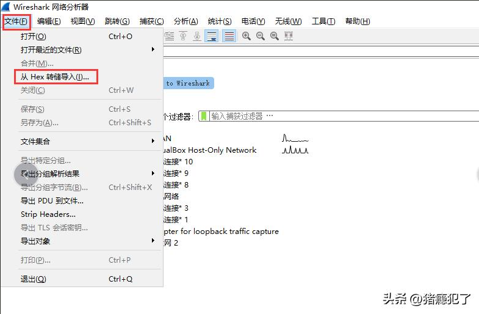
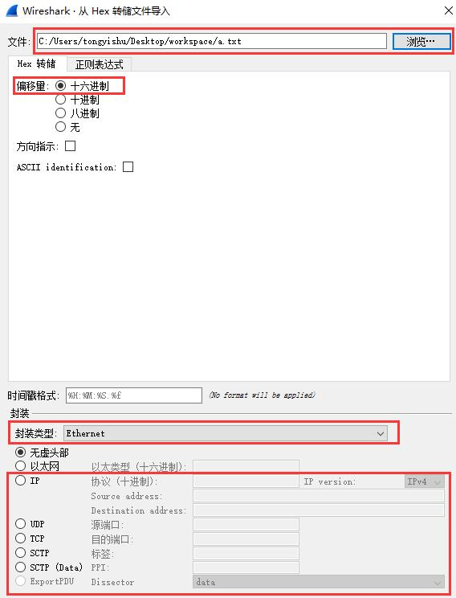
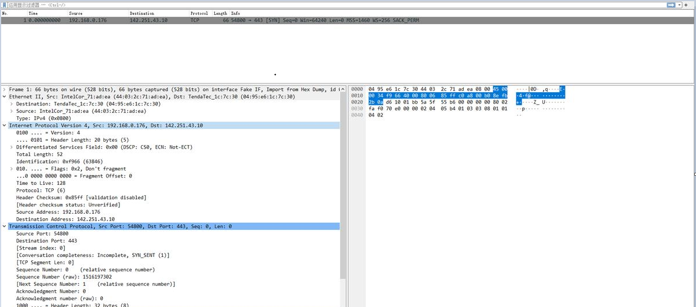

# 遇到的问题

我们经常会遇到已经dump出来的报文的十六进制形式，比如：

```bash
04 95 e6 1c 7c 30 44 03 2c 71 ad ea 08 00 45 00 00 34 f9 66 40 00 80 06 85 ff c0 a8 00 b0 8e fb 2b 0a d6 10 01 bb 5a 5f 55 b6 00 00 00 00 80 02 fa f0 70 e0 00 00 02 04 05 b4 01 03 03 08 01 01 04 02
```

Ethernet Header很容易可以看出来：源MAC为04:95:e6:1c:7c:30，目的MAC为44:03:2c:71:ad:ea，报文类型为IPv4：0800。但IP地址就不容易看出来了，因此我们需要用wireshark工具来解析该报文。

# 如何解析报文

1、在十六进制报文前加上8个0，只保留一行，并保存为.txt文件：

```bash
00000000 04 95 e6 1c 7c 30 44 03 2c 71 ad ea 08 00 45 00 00 34 f9 66 40 00 80 06 85 ff c0 a8 00 b0 8e fb 2b 0a d6 10 01 bb 5a 5f 55 b6 00 00 00 00 80 02 fa f0 70 e0 00 00 02 04 05 b4 01 03 03 08 01 01 04 02
```

2、打开wireshark工具，选择"文件" -> "从Hex转储导入"



3、选择要导入的文件，并选择"十六进制"，封装类型选择Ethernet（如果不包含Ethernet头，只导入IP或UDP等报文，只需要勾选"IP"、"UDP"或"TCP"字段），然后导入：



4、导入后即可查看报文的具体内容，包括报文的Ethernet Header/IP Header/TCP Header/UDP Header等：


