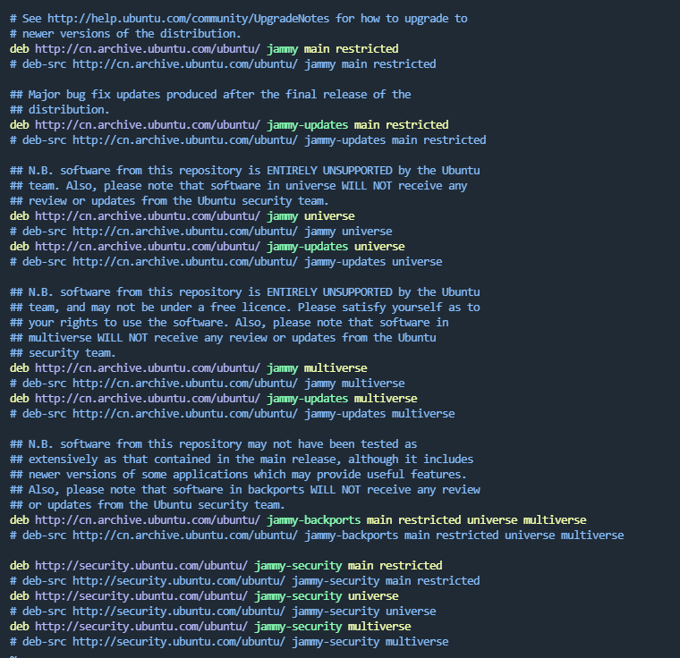

# apt配置文件示例

配置文件路径: /etc/apt/sources.list

# apt配置文件解析

在/etc/apt/sources.list文件中，每行代表一个软件源的配置。下面是该配置各个字段的解释：

1、deb 或 deb-src：表示软件包的类型。

- deb 表示二进制软件包
- deb-src 表示源代码软件包。

2、http://archive.ubuntu.com/ubuntu/：软件源的地址，指明软件包所在的服务器地址。

3、bionic：发行版代号，指明软件包适用的操作系统版本。如 Ubuntu 18.04 为 bionic。

4、main、restricted、universe、multiverse 等：这些是软件包的组件，主要包括：

* main：官方支持的自由软件。
* restricted：官方支持的但非自由软件，通常包含一些受限制的驱动程序等。
* universe：社区维护的自由软件。
* multiverse：非自由软件或带有专利的软件。

5、security、updates、backports 等：这些是软件包的更新策略，用于指定从哪些部分更新软件包，例如：

* security：安全更新。
* updates：常规更新。
* backports：向前兼容的软件包
