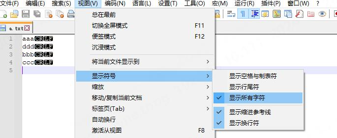
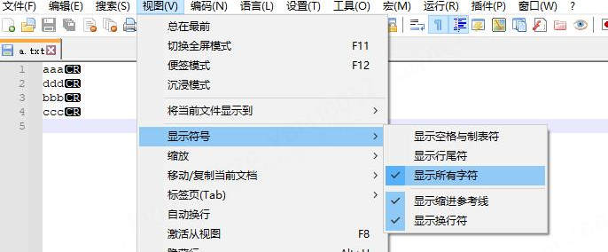

# 回车与换行的类型

**回车（Carriage Return，CR）** ，回车符的ASCII码是13，通常表示为\r。在机械打字时代，回车是指将打印头移动到所在行最左边的位置，打印头所处的行数不变。

**换行（Line Feed，LF）** ，换行符的ASCII码是10，通常表示为\n。在机械打字时代，换行意味着将纸张向上移动一行，打印头所在的位置不变。

随着计算机的发展，逐渐形成了**windows、linux和mac行末EOL（End of Line）的不同** ：

- windows：EOL = CR + LF
- linux：EOL = LF
- mac：EOL = CR

# 回车与换行的示例

比如我们有一个文件，文件内容如下（vim中使用set list命令显示出了EOL符号"$"）：

```bash
aaa$
ddd$
bbb$
ccc$
```

1、如果该文件在vim中set fileformat=dos，则通过notepad++打开后，EOL显示为CRLF



2、如果该文件在vim中set fileformat=unix，则通过notepad++打开后，EOL显示为LF


3、如果该文件在vim中set fileformat=mac，则通过notepad++打开后，EOL显示为CR


