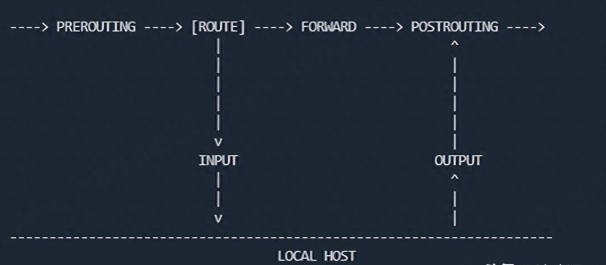

# iptables概述

iptables工具和ip6tables工具主要用于建立、维护和检查Kernel中IPv4和IPv6的包过滤规则（简单点讲，就是防火墙）。Kernel定义了一些表（table）。每个表包含许多内置链（chain），也可以包含用户自定义链。每个链是一组规则的列表，可以匹配一组数据包。每个规则指定如何处理匹配的数据包，这被称为"target"，它可以跳转到同一表中的用户定义链。

# iptables chain

在介绍表之前，需要先介绍一下链的概念。Kernel定义了5条链（INPUT、PREROUTING、FORWARD、POSTROUTING 、OUT），分别对应netfilter的5个挂载点（netfilter在L3的包处理流程中，添加了对应的hook函数）。

| **链名称** | **挂载点**                                         |
| ---------------- | -------------------------------------------------------- |
| INPUT            | 目的地为本机的数据包，送往应用层处理之前                 |
| PREROUTING       | 查路由表之前                                             |
| FORWARD          | 查路由表后，发现目的地不是本地，继而查转发表之前         |
| POSTROUTING      | 查路由表和转发表后或本机生成数据包后，发往物理链路层之前 |
| OUTPUT           | 本地应用层生成的数据包之后，发往物理链路层之前           |

# iptables table

Kernel内置了5张表，分别是mangle、filter、nat、secrity、raw。

| **表名** | **功能**                                                                                                                                                              |
| -------------- | --------------------------------------------------------------------------------------------------------------------------------------------------------------------------- |
| filter         | 控制数据包的进出及转发（默认表），包含INPUT，FORWARD，OUTPUT三条链                                                                                                          |
| nat            | 控制数据包中的地址转换，包含PREROUTING，INPUT，OUTPUT，POSTROUTING四条链                                                                                                    |
| mangle         | 修改数据包中的原数据，包含PREROUTING，INPUT，FORWARD，OUTPUT，POSTROUTNG五条链                                                                                              |
| raw            | 用于处理异常，包含PREROUTING，OUTPUT两条链                                                                                                                                  |
| security       | 在filter表过滤完数据包之后，再使用security表进行数据包过滤，包含INPUT，FORWARD，OUTPT三条链（并不是所有主机都有security表，只有那些安全性要求较高的主机才会配置security表） |

# iptables paramter及action

| **Paramter** | **功能**                                                                              |
| ------------------ | ------------------------------------------------------------------------------------------- |
| -A                 | 追加规则                                                                                    |
| -D                 | 删除规则                                                                                    |
| -I                 | 插入规则                                                                                    |
| -F                 | 清除规则                                                                                    |
| -L                 | 列出规则                                                                                    |
| -R                 | 替换规则                                                                                    |
| -Z                 | 清空统计信息                                                                                |
| -S                 | 列出规则（以iptable-save的形式）                                                            |
| -p                 | 指定协议                                                                                    |
| -m                 | 扩展匹配，比如-m tcp，可以使用tcp的扩展模块（提供了--dport，--tcp-flags，--sync等匹配功能） |
| -s                 | 指定源IP                                                                                    |
| -d                 | 指定目的IP                                                                                  |
| -j                 | 指定目标动作                                                                                |
| -n                 | 数字化显示                                                                                  |
| -i                 | 指定入接口                                                                                  |
| -o                 | 指定出接口                                                                                  |
| --sport            | 指定源端口                                                                                  |
| --dport            | 指定目的端口                                                                                |
| --string           | 匹配应用层字符串                                                                            |

| **Action** | **功能**           |
| ---------------- | ------------------------ |
| ACCEPT           | 允许数据包通过           |
| DROP             | 丢弃数据包               |
| REJECT           | 拒绝数据包通过           |
| LOG              | 将数据包记录到syslog日志 |
| DNAT             | 目标地址转换             |
| SNAT             | 源地址转换               |
| MASQUERADE       | 地址欺骗                 |
| REDIRECT         | 重定向                   |

# iptables使用示例

`iptables-save -t nat -c > iptables.bak` 备份iptables的nat表（-c包含统计信息）到iptables.bak

`iptables-restore < iptables.bak` 从iptables.bak恢复iptables

`iptables -nvL` 查看filter表所有链的规则

`iptables -t nat -S` 以iptables-save的形式查看nat表的规则

`iptables -Z` 清除所有表的所有链的统计信息

`iptables -F -t nat` 清除nat表所有链的规则

`iptables -I FORWARD -p tcp –dport 22 -j ACCEPT` 如果数据包的目的端口为22，则接受对该数据包的转发

`iptables -t nat -I PREROUTING 1 -d 192.168.56.104 -p tcp -m tcp --dport 2234 -j DNAT --to-destination 192.168.56.108:22` 将目的地址为192.168.56.104:2234的包转发到192.168.56.198:22
