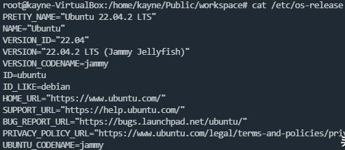
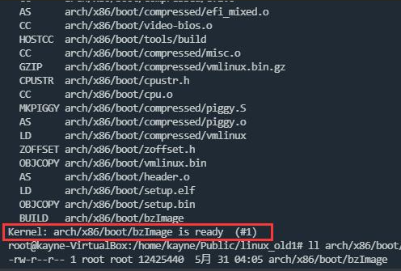
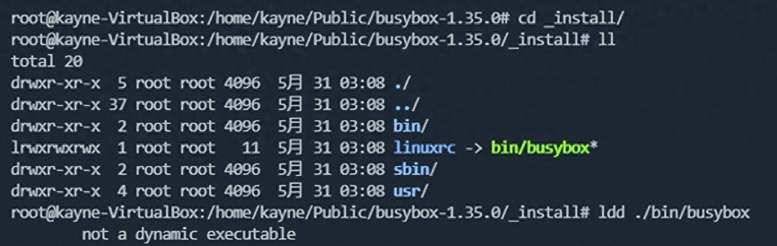
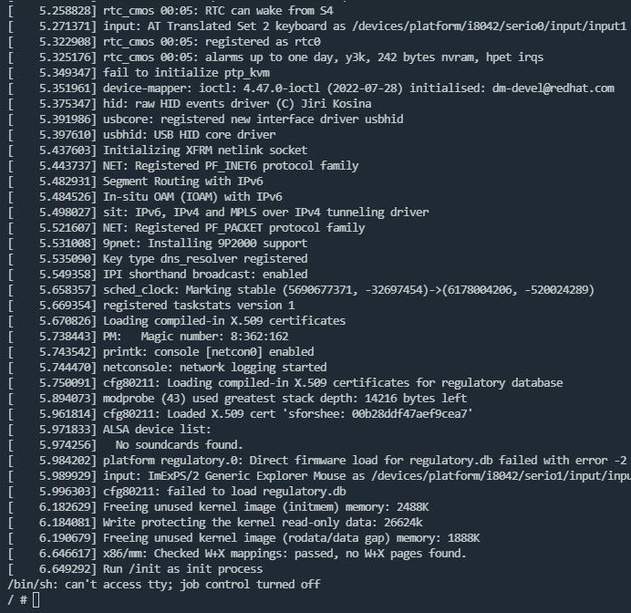

# 环境准备

* 使用虚拟机编译并启动linux内核，虚拟机通过VirtualBox创建，VirtualBox-7.0.12版本：

  
* 操作系统使用Ubuntu 22.04.2 LTS版本:

  
* 安装依赖的工具：

```bash
apt install fakeroot build-essential ncurses-dev xz-utils libssl-dev bc flex libelf-dev bison qemu-system-x86
```

# 下载代码

由于github上下载的速度太慢，这里我从gitee上下载镜像代码，并切换到v6.2的内核版本：

```bash
git clone https://gitee.com/mirrors/linux_old1.git
git checkout v6.2
```

# 编译内核

```bash
cd linux_old1
make mrproper
make defconfig
make -j
```

make mrproper 清除上次的编译残留

make defconfig 生成默认的.config配置文件

make -j 编译时使用所有cpu进行加速

编译完成后生成的arch/x86/boot/bzImage文件，即为我们所要的内核镜像：



# 制作initramfs文件系统

拉起内核时需要一个临时的根文件系统（initramfs），用于后续引导真正的根文件系统（ext4）。

## 编译安装busybox

内核引导时需要一个临时的根文件系统（initramfs），该文件系统通常包含必要的程序和工具（cp/ls/cat），以便系统能够挂载真正的根文件系统（ext3/ext4）。BusyBox提供了这些必要的程序和工具。编译和安装的步骤如下：

```bash
wget https://busybox.net/downloads/busybox-1.35.0.tar.bz2
tar -xvf busybox-1.35.0.tar.bz2

cd busybox-1.35.0
make mrproper
make defconfig
sed -i 's/# CONFIG_STATIC is not set/CONFIG_STATIC=y/' .config
make -j
make install
```

**make mrproper** 清除上次的编译残留

**make defconfig** 生成默认的.config配置文件

**sed -i 's/# CONFIG_STATIC is not set/CONFIG_STATIC=y/' .config** 使用静态编译，使得生成的busybox为独立的程序，而不依赖各种动态链接库.so

**make -j** 编译busybox，-j会自动使用最所有cpu编译，能够加快编译速度

**make install** 安装busybox，默认安装在_install目录下

安装完成后目录如下：



## 制作initramfs文件系统

```bash
cd busybox-1.35.0/_install
mkdir -p bin
mkdir -p sbin
mkdir -p usr/bin
mkdir -p usr/sbin
mkdir -p etc
mkdir -p sys
mkdir -p lib
mkdir -p proc
echo '#!/bin/sh
mount -t proc proc /proc
mount -t sysfs sysfs /sys
/bin/sh' > init
chmod +x init
find . | cpio -o --format=newc > initramfs.cpio
```

完成后生成的initramfs.cpio，即为我们要的临时文件系统。

# 启动内核

```bash
qemu-system-x86_64 -smp 1 -m 512M -kernel ./bzImage -initrd ./initramfs.cpio -append "console=ttyS0" -nographic
```

各个参数的含义如下：

**-smp** 指定cpu个数

**-m** 指定内存大小

**-kernel** 指定内核镜像

**-initrd** 指定初始的ram镜像

**-append** 内核拉起的cmdline

**-nographic** 不使用图形化界面

启动后自动执行/init脚本，进入bash程序：


