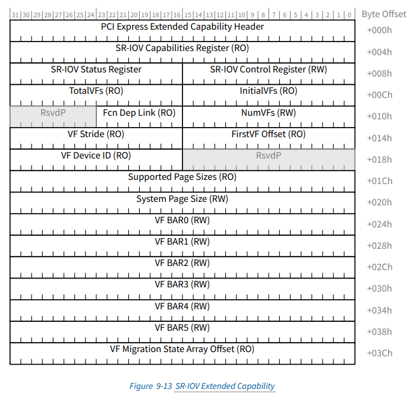

# 什么是sr-iov？

网络设备（Net Device）对于主机（HOST）的呈现，大多数都是通过PCIe实现的。说到PCIe就不得不说PCI号，通常为xx:xx.x的形式，比如：00:bd.1（在linux上可以通过lspci命令查看）。PCI号在PCIe硬件领域的专业术语叫作BDF（Bus.Device.Function，总线.设备.功能）。在BDF中，Bus占用8bit，Device占用5bit，Function占用3bit。显然PCIe最多支持256个总线，每个总线最多支持32个设备，每个设备最多支持8个功能。需要注意的是，PCIe正是通过BDF号来区分不同设备的不同功能的。

sr-iov是Single Root I/O Virtualization（单根I/O虚拟化）的缩写，这里的root是指物理根，即物理服务器或计算结节，一个物理根独占整个PCIe设备的资源。与sr-iov对应的还有mr-iov，即多根I/O虚拟化，一个pcie设备被多个物理根共享，每个物理根只占用设备上的部分资源。

上面说到，PCIe的Bus.Device下面有很多Function。对于支持sr-iov的网络设备而言，这些Function是彼此独立的物理功能（Physical Function），简称PF。每个PF都可以当作一个独立的物理网卡来使用。**sr-iov通过将每个Physical Function的资源（比如Queue-Pair，Register等）进行整合和配置，产生一个个虚拟功能（Virtual Function），简称VF** 。需要注意的是，PF拥有完整的PCIe配置空间，VF仅拥有简化的PCIe配置空间。

简单总结一下，sr-iov就是在单物理服务器的场景下，用一个PF产生多个VF的技术。

# sr-iov如何配置生成VF？

sr-iov通过PCIe的扩展能力头（PCIe Extended Capability Header）对PF的配置空间进行配置：

* TotalVFs，所有（最大）VF的个数，比如，使用"echo 8 > /sys/bus/pci/devices/0000:bd:00.1/max_vfs"配置max_vfs的数量为8
* InitialVFs，初始化VF的个数，对于sr-iov而言，必须与TotalVFs保持一致，mr-iov另说
* NumVfs，用户开启的VF个数，可配置
* VF Stride，表示相邻两个VF之间的BDF偏移量
* FirstVF Offset，第一个VF相对于PF的BDF偏移量
* VF Device ID，VF的device_id，与PF的device_id不同，用于区分PF和VF

其它域段参见PCIe官网的规格文档：
https://pcisig.com/specifications

我使用的版本为：
https://members.pcisig.com/wg/PCI-SIG/document/13005
