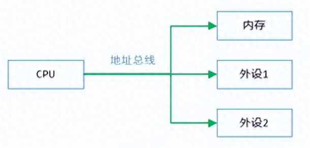
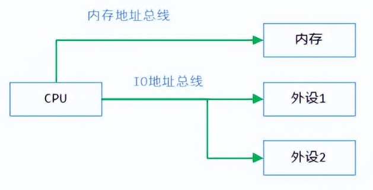

# PCIe的配置空间/IO空间/内存空间

PCIe的**配置空间/IO空间/内存空间** 都是指设备空间，存在于设备中，而不是主机空间。但主机可以通过PCIe，进行**配置映射/IO映射/内存映射** ，将这些设备空间映射到主机的内存之中，这样主机就可以像访问主机内存一样来访问设备空间，以便进行数据传输和交互。

PCIe配置空间，**简单的讲就是一组配置寄存器** （Configuration Registers），这些寄存器用来描述设备本身的特性和功能。PCIe设备的配置空间大小通常是256字节，其中前64字节是PCIe通用的配置头，其余192字节则是设备特定的配置。

* 配置空间的起始地址默认为0x00000000
* 配置空间的大小默认为256字节

随着PCIe设备的发展，设备需要更多的配置空间来描述自身的特性和功能，256字节已经不能满足配置要求。因此可以通过**扩展配置空间** 的方式，来增加PCIe设备的配置空间，该方式（可选）将配置空间的大小由原来的256字节扩展到4096字节。

PCIe IO空间，**本质是也是一组寄存器** ，主机通过读写寄存器进行设备的输入输出操作。在x86架构中，I/O空间是独立的，通常位于0x0000到0xFFFF范围内，可以通过IN和OUT指令来进行读写。在ARM架构中，I/O空间通常与内存地址空间共享，设备寄存器被映射到内存地址空间的特定位置，可以使用访存指令来进行读写。

PCIe 内存空间，设备的内存空间通常是通过内存映射（memory mapping）的方式来实现的，即将设备内存映射到主机内存。这使得主机通过内存访问指令来读写设备内存空间，就像访问普通的系统内存一样。

# 为什么会出现IO空间和内存空间？

IO空间和内存空间理论上都可以使用一种空间（内存空间）来表示，为什么会出现两种空间？

统一编址和独立编址导致了IO空间和内存空间的分离。

* Arm等其它平台采用统一编址

  

* X86采用独立编址（导致了IO空间和内存空间的分离）

  
