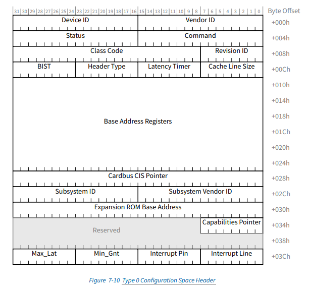
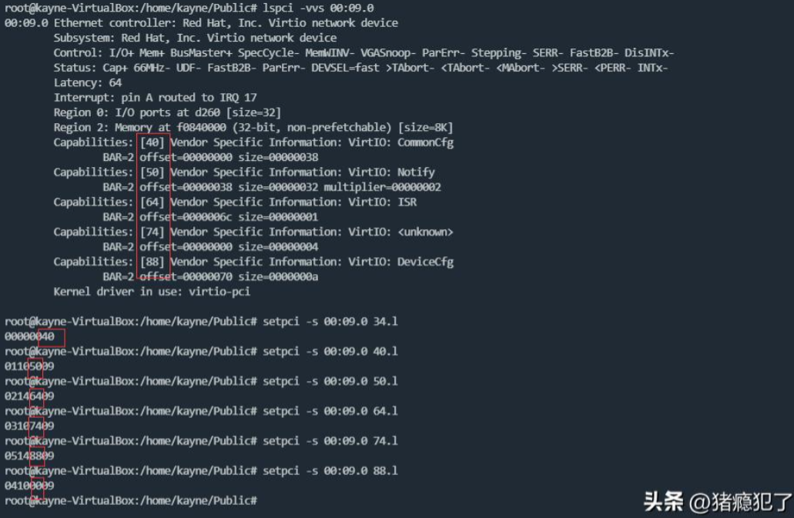
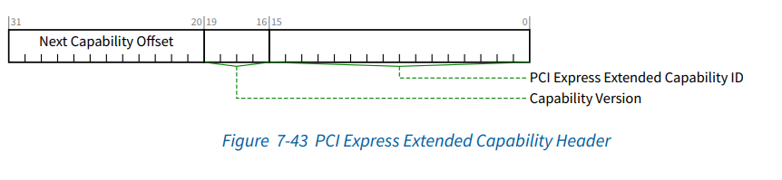

# PCIe Capability（基础能力集）

PCIe Capability是指PCIe设备的基础能力，包含了设备的基本信息，比如设备类型、速度、链接状态、电源管理、错误处理等。PCIe Capability存储在PCIe的标准配置空间中（0x00\~0xff，256Byte），该空间对PCI和PCIe设备兼容。PCIe的标准配置空间使用PCI Header（0x00\~0x3c）进行配置，主要有两种：Type0（Endpoint，PCIe端设备）和Type1（Switch，PCIe交换设备）。一般都是对Type0类型的设备进行配置：

其中，Capabilities Pointer指向下一个PCIe Capability结点（起始地址一般为为0x40），Capabilities Pointer为0表示终止PCIe Capability结点的扫描（PCIe Capability以链表的形式组织）。

常用的PCIe基础能力如下：

| Capability ID | 基础能力                                     | 能力描述                                                                            |
| --------------- | ---------------------------------------------- | ------------------------------------------------------------------------------------- |
| 0x01          | Power Management                             | 提供设备电源管理功能，包括设备的低功耗状态                                          |
| 0x02          | AGP (Accelerated Graphics Port)              | 描述了加速图形端口（AGP）的功能，AGP是一种旧的高速显卡接口标准                      |
| 0x03          | Vital Product Data (VPD)                     | 用于存储设备的关键产品数据，如序列号和部件号                                        |
| 0x05          | MSI (Message Signaled Interrupts)            | 支持通过消息信号中断替代传统的线中断，这种机制可以提高系统的中断处理效率            |
| 0x11          | MSI-X (Message Signaled Interrupts eXtended) | 扩展了MSI功能，允许更多的中断消息向量，同时为每个中断向量提供了独立的屏蔽和消息地址 |
| 0x10          | Express Root Port                            | 描述PCIe RP设备相关的特性                                                           |
| 0x09          | Vendor-Specific                              | 允许设备制造商添加特定于厂商的功能和数据                                            |
| 0x0c          | PCI Hot-Plug                                 | 提供PCI热插拔功能，使设备能够在不关闭系统电源的情况下进行插拔                       |
| 0x12          | SATA (Serial ATA) Data/Index Configuration   | 支持SATA接口的配置                                                                  |
| 0x0D          | CompactPCI Hot Swap                          | 用于CompactPCI系统中的热插拔管理                                                    |

# PCIe Extended Capability（扩展能力集）

PCIe Extended Capability是指PCIe设备的扩展能力，它允许设备厂商定义和实现特定的功能，比如sr-iov。PCIe Extended Capability存储在PCIe的扩展配置空间中（0x100\~0xfff，4096Byte），该空间为PCIe设备独有。所有的PCIe扩展能力必须以PCIe Extended Capability Header开头：

其中，Next Capability Offset指向下一个扩展能力（**和PCIe基础能力一样，以链表的形式组织** ），Capability Version表示该扩展能力的版本变化，PCI Express Extended Capability ID表示哪一种扩展能力。常用的PCIe扩展能力如下：

| Capability ID | 扩展能力                                                 | 能力描述                                      |
| --------------- | ---------------------------------------------------------- | ----------------------------------------------- |
| 0x0001        | Advanced Error Reporting (AER)                           | 提供高级错误报告和错误检测功能                |
| 0x0002        | Virtual Channel (VC)                                     | 支持虚拟通道和流控操作                        |
| 0x0003        | Device Serial Number (DSN)                               | 提供设备的唯一序列号                          |
| 0x0004        | Power Budgeting                                          | 提供对设备功耗预算的管理                      |
| 0x0005        | Root Complex Link Declaration (RCLD)                     | 用于根复合体的链路声明                        |
| 0x0006        | Root Complex Internal Link Control (RCILC)               | 控制根复合体内部的链路                        |
| 0x0007        | Root Complex Event Collector Endpoint Association (RCEC) | 关联根复合体事件收集器端点                    |
| 0x0008        | Multi-Function Virtual Channel (MFVC)                    | 多功能虚拟通道支持                            |
| 0x0009        | Virtual Channel (Enhanced VC)                            | 扩展的增强版的虚拟通道功能                    |
| 0x000a        | Secondary PCI Express (PCIe-to-PCIe Bridge)              | 支持二次PCIe设备之间的桥接                    |
| 0x000b        | Access Control Services (ACS)                            | 提供对PCIe设备的访问控制服务                  |
| 0x000c        | Alternative Routing-ID Interpretation (ARI)              | 支持替代路由ID解释，允许设备端口超过256个功能 |
| 0x000d        | Address Translation Services (ATS)                       | 支持地址翻译服务                              |
| 0x0010        | Single-Root I/O Virtualization (SR-IOV)                  | 支持单根I/O虚拟化                             |
| 0x0011        | Multi-Root I/O Virtualization (MR-IOV)                   | 支持多根I/O虚拟化                             |
