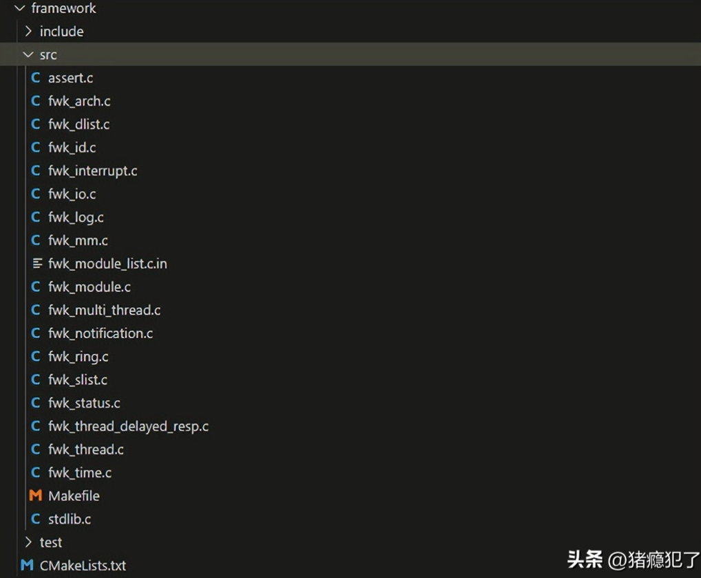
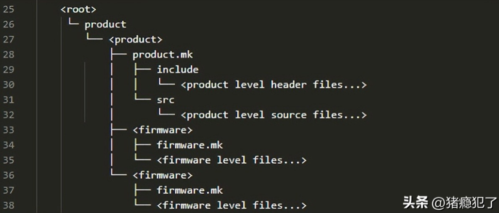
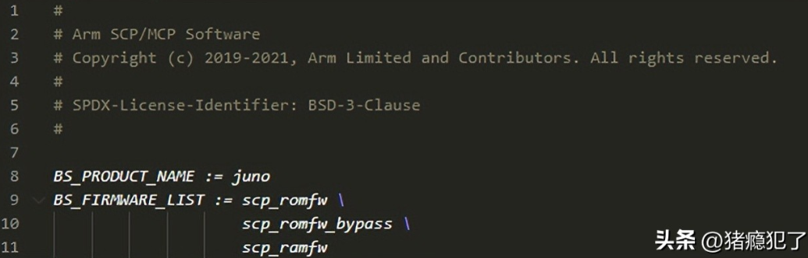
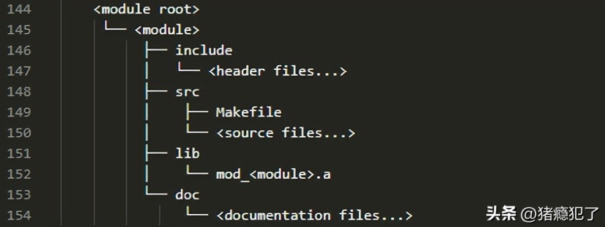

# 什么是scp_firmware

scp_firmware是SCP（System Control Processor）固件开发的框架代码。SCP通常用于操作系统，MCP通常用于BMC远程管理，二者均为处理器。scp_firmware可以简单的理解为：小型CPU的操作系统（固件）。

github地址：
https://github.com/ARM-software/SCP-firmware

# 目录结构

scp_firmware目录结构如下所示，几个比较核心的目录：framework、product、module：

# framework

framework目录下存放的是scp_firmware的框架代码，产品在该框架下实现自己的固件，框架提供一些基础库和一些通用的模块。该目录下的源文件通常以fwk开头（framework）。

# product

product目录是固件的集合，该目录下的每个子目录都代表一个产品的固件，必须遵循以下层次结构：

product.mk是产品固件的Makefile文件，指定了生成的固件名称，比如Juno Soc的product.mk如下（编译后会生成3个二进制文件
scp_romfw/scp_romfw_bypass/scp_ramfw）：

# module

每个产品固件都会划分为多个模块（module），固件的模块可以在项目根目录下的module/目录下实现，也可以在product/xxx/module/目录下实现（推荐使用后者，前者一般存放通用的公共模块）。在任何一种情况下，模块都具有以下目录结构：

