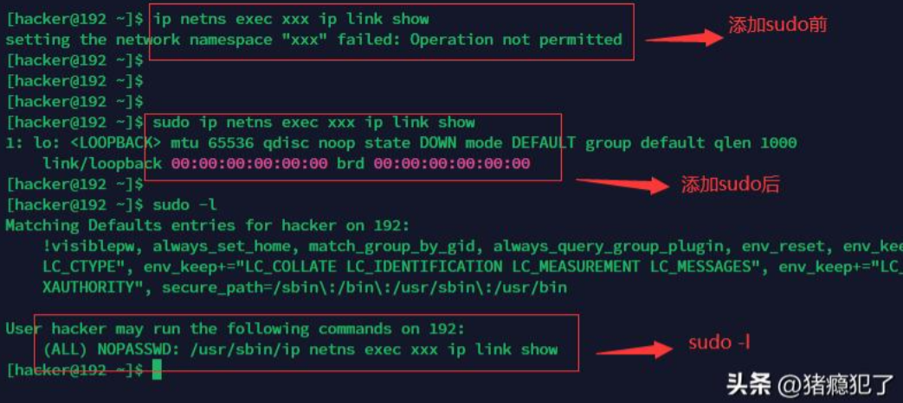
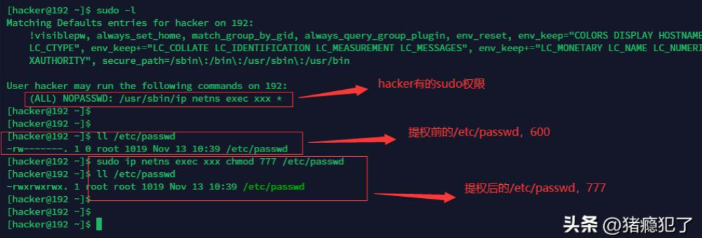

普通用户（比如hacker）的权限默认都比较低，如果想要执行高权限用户（比如root）的命令，就需要使用sudo提权。

例如`ip netns exec xxx ip link show`命令（查看网络命名空间xxx中的网络设备），如果未使用sudo就会报`Operation not permitted`的错误。

一种十分简单的配置sudo的方式，是在`/etc/sudoers.d/`目录下增加hacker用户的sudoer文件，比如
`/etc/sudoers.d/hacker_sudoer`，在该文件中追加以下内容：

```bash
hacker ALL=(ALL) NOPASSWD: /usr/sbin/ip netns exec xxx ip link show
```

这样hacker便有了执行`ip netns exec xxx ip link show`的权限，这也是嵌入式设备最常见的配置方式。

可以通过切换到hacker用户环境，使用sudo -l命令查看当前拥有的sudo权限。



很多开发人员在开发时为了省事（目的是为了在命令空间中执行更多ip命令），将sudo配置为以下内容：

```bash
hacker ALL=(ALL) NOPASSWD: /usr/sbin/ip netns exec xxx *
```

以"*"代替具体的规则，殊不知这会带来很大的安全隐患，一旦hacker用户被攻破，root也会被提权，示例如下：



因此在日常的开发过程中，一定要注意安全问题，时刻绷紧安全这根弦，一个不留神，整台服务器就会在全网上裸奔。
