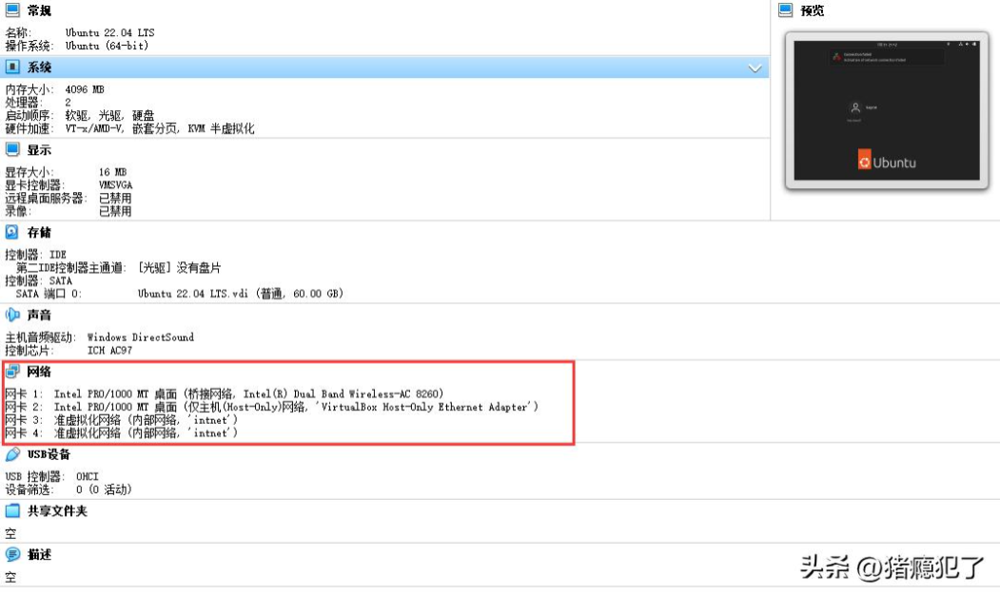
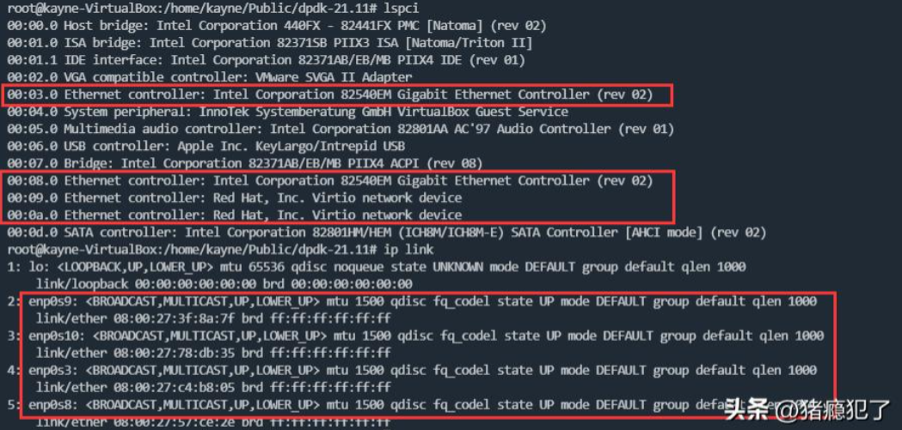
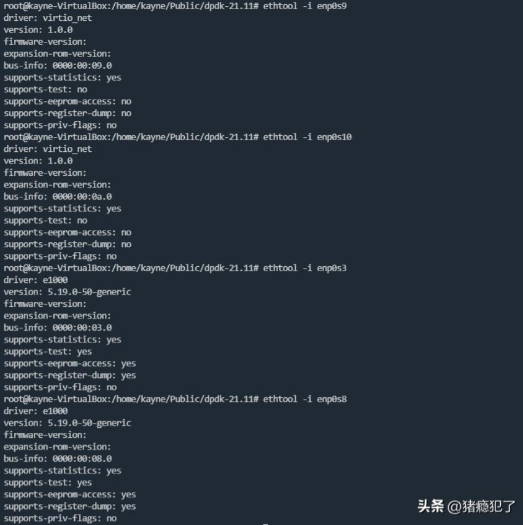
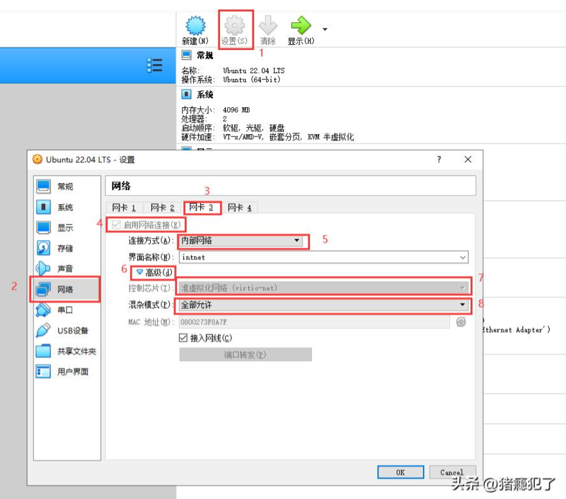

使用VirtulaBox拉完虚机后，默认只有一个网卡，显然这是不够用的。VirtualBox允许每个虚机最大创建4张网卡，默认启用网卡1，网卡2/3/4不启用。

# Host主机上的网卡配置

网卡1：是桥接网卡，直接连接家里的路由器，用于上网。

网卡2：仅主机（Host-Only）网络，只和Host物理机相连，用于ssh登录。

网卡3/4：准虚拟化网络，即Virtio net设备。

# 虚机中网卡的存在形态

虚机中网卡挂在PCI总线上，如上图所示。
enp0s3/enp0s8/enp0s9/enp0s10分别对应00:03.0/00:08.0/00:09.0/00:0a.0。

其中enp0s9和enp0s10是Virtio net device，使用Virtio net driver。

# Virtio net device的创建过程

1. 打开"设置"
2. 点击"网络"
3. 点击"网卡"
4. 勾选"启用网络连接"
5. 选择"连接方式"（这里我选的"内部网络"，其它的也可以）
6. 点击"高级"
7. "控制芯片"选择"准虚拟化网络（virtio-net）"
8. "混杂模式"选择"全部允许"
