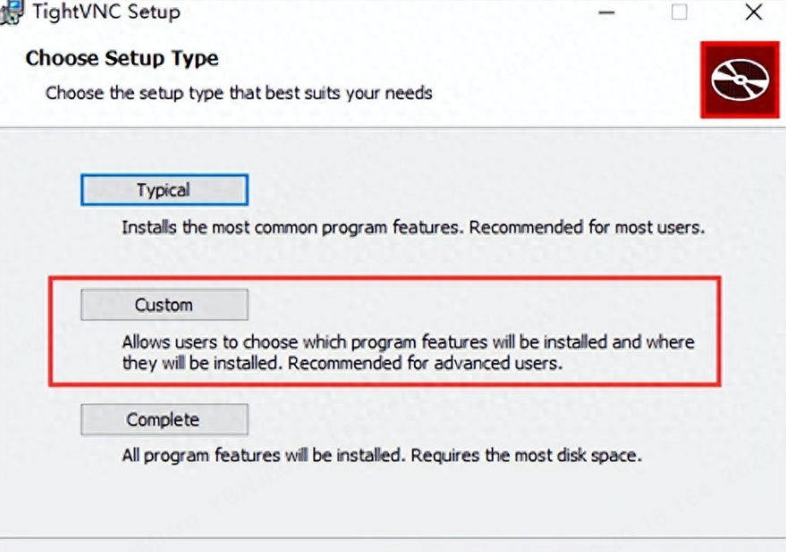
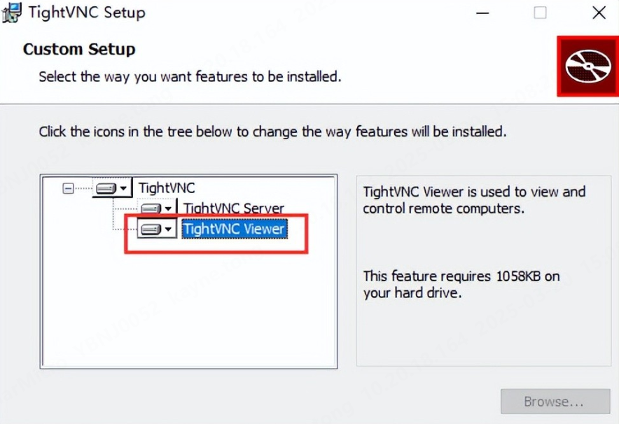
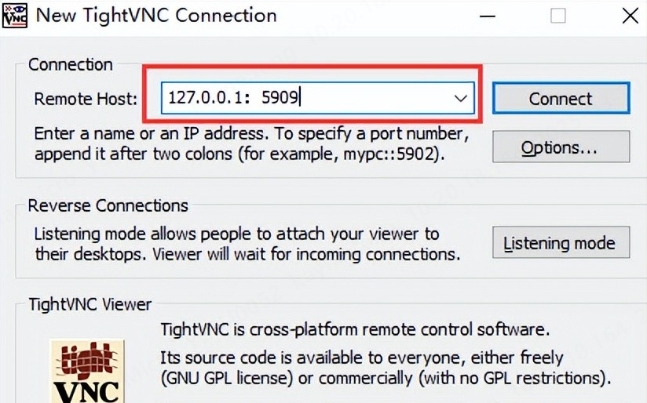

# TightVNC Viewer是什么

VNC的客户端叫VNC Viewer，常用的VNC Viewer工具有：RealVNC Viewer、TIghtVNC Viewer、UltraVNC Viewer、TigerVNC Viewer等。

TightVNC是一种基于VNC协议的免费的开源软件，用于实现远程桌面控制和访问。它是一个轻量级的VNC解决方案，适用于Windows和Linux系统。TightVNC的服务端为TightVNC Server，客户端为TightVNC Viewer。

# TightVNC Viewer下载

官网链接：
https://www.tightvnc.com/download.php

安装的时候最好选择“Custom”，进行自定义安装，只安装VNC Viewer，不安装VNC Sever。

# TightVNC Viewer使用

输入VNC的IP及PORT即可远程连接，使用qemu创建虚机时一般会指定-vnc参数，比如 -vnc 0.0.0.0:9。如果使用VNC Viewer连接，需要在PORT的基础上再加5900，即连接时的端口号为5909 = (5900 + 9)。

