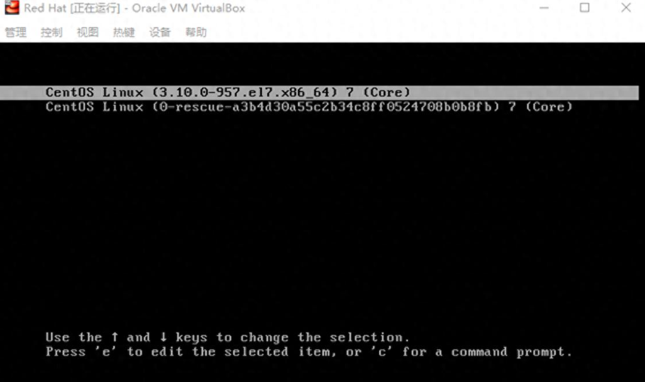
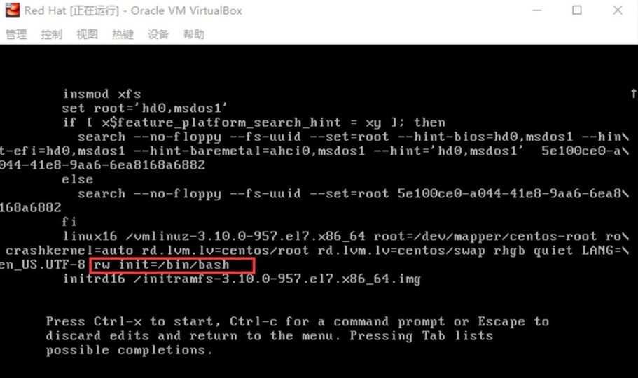
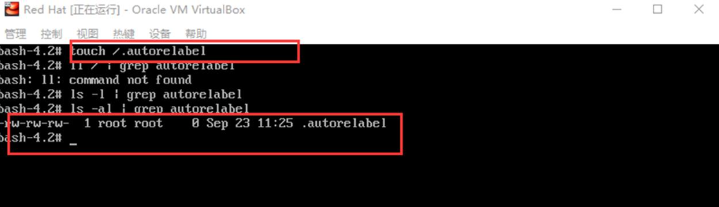
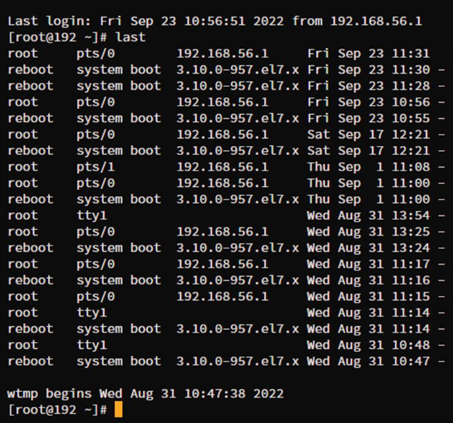

# 1 遇到的问题

使用Linux的过程中，经常会遇到忘记密码的情况。大多数人遇到这种情况都会选择重新安装操作系统，毕竟Linux的密码系统不是那么容易攻破的。这里有个方法，只要你有VNC的权限，就可以通过boot重新设置你的Linux密码，非常的好用。

# 2 解决方法

1．`reboot`重新拉起虚机，当出现选择操作系统的界面时按"e"，可以看到内核的启动参数。

2．编辑内核启动参数，尾部追加`rw init=/bin/bash`，其中rw表示可读写（一定要加上，不然进入系统后不可修改文件），init=/bin/bash表示内核启动后拉起的第一个进程（pid=1）为/bin/bash，而不是/lib/systemd。

3．`ctrl + x`启动系统，进入bash交互式界面。

4．使用`passwd root`命令修改root的密码。

5．`touch /.autorelabel`让SELinux重新给系统资源打标签，即使SELinux失效。

6．强制重启虚机即可恢复ssh登录，此时不再需要VNC。

